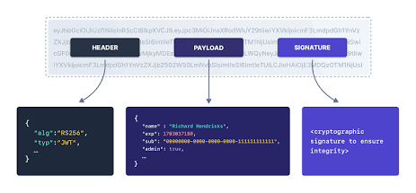
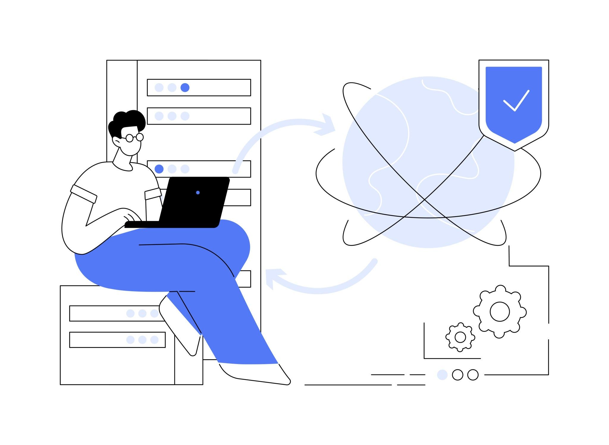

# Untitled

## The True Cost of Security and The Attacker Mindset

Security in a backend application is fundamentally tied to business survival. When a backend is compromised, the destructive effects are always financial—it costs money in stolen resources, lost customer trust, and regulatory fines.

Security exists in multiple layers, and you need to know which context you are operating in:

- **Browser Security:** Dealing with HTML, cookies, and local storage on the client side.
- **Network Security:** The transition layer protecting data in transit using HTTP/HTTPS protocols, encryption, and compression.
- **Server/OS Security:** The environment where your code runs, handling system calls and file system access.
- **Backend Application Security:** The actual code you write, the libraries you import, and how you process data. This is our focus.

**The Mindset:** We use the term **attacker** rather than "hacker" to avoid the cringe and Hollywood stereotypes associated with the word. An attacker doesn't care what framework or language (NodeJS, Go, Rust, Python) you are using. They only care about finding answers to one question: *Where did the developer make an assumption?*

Every vulnerability stems from developer assumptions:

1. Assuming input coming from the frontend is clean.
2. Assuming the user is who they claim to be.
3. Assuming requests to the backend actually originated from your own frontend.
4. Assuming no one will open the browser's Network tab to inspect and modify request parameters.

Under tight deadlines in a startup, developers build for the "happy path"—assuming users click the right buttons and fill forms correctly. Attackers do the opposite. They poke at boundaries and deliberately send malformed data to break assumptions.

## Injection Attacks: The Boundary Problem

Your backend application is multilingual. It speaks to databases using **SQL** or JSON, it might speak to a browser by sending HTML/CSS, and it speaks to the operating system using Shell scripts/commands.

An **Injection Attack** happens when user data crosses the boundary between these languages and gets misinterpreted as a command.

- *Real-life comparison:* Imagine you hand a delivery driver a note that says: "Deliver to: [Customer Name]". You expect the customer name to be "John". But the customer enters their name as "John. Also, throw the package in the river." If the driver reads the whole thing as an instruction, your package is gone. You confused *data* (the name) with an *instruction* (the action).

### SQL Injection (SQLi)

Let's look at a standard login page. The user inputs an email and password, which the browser sends to the server, and the server queries the database (DB).

A naive developer might construct the DB query by concatenating strings:

```sql
SELECT * FROM users WHERE email = '<user_input>'
```

**The Happy Path:** If the user enters `alice@gmail.com`, the server constructs:

```sql
SELECT * FROM users WHERE email = 'alice@gmail.com'
```

The database executes this, finds Alice, and logs her in.

**The Attack:** An attacker inputs the following string into the email field: `' or '1'='1' --`

The server blindly drops this into the template, creating this final query:

```sql
SELECT * FROM users WHERE email = '' or '1'='1' --'
```

Let's break down why this is catastrophic based on SQL syntax:

1. **The first `'` (single quote):** This prematurely closes the string the developer opened. The DB now thinks the email being searched is an empty string `''`.
2. **`or`:** A logical operator. It tells the DB to return a row if the first condition (email is empty) is true, OR if the second condition is true.
3. **`'1'='1'`:** The string "1" always equals the string "1". This evaluates to `TRUE`.
4. **`-` (double dash):** In SQL, this is the comment symbol. It tells the DB to completely ignore the rest of the line (including the leftover closing quote from the developer's template, which would have otherwise caused a syntax error).

Because `OR TRUE` is appended to the query, the `WHERE` clause applies to every single row in the database. The attacker doesn't need a password; the database simply returns a list of *every user in the system*.

### Demonstrating SQLi using DB Explorer (TablePlus)

To visualize this, a database explorer GUI (like TablePlus) can execute raw commands. First, we define our database structure:

```sql
CREATE TABLE users (name text, email text);
```

We insert mock data:

```sql
INSERT INTO users (name, email) VALUES ('Alice', 'alice@gmail.com'), ('Bob', 'bob@gmail.com');
```

Running our malicious injection query (`SELECT * FROM users WHERE email = '' or '1'='1' --'`) in this tool will output both Alice and Bob's records.

### Destructive SQLi and Database Protections

Attackers can do much worse than just reading data. What if their input is: `; DROP TABLE users; --`

The resulting query:

```sql
SELECT * FROM users WHERE email = ''; DROP TABLE users; --'
```

The `;` (semicolon) terminates the first query. The next command, `DROP TABLE users;`, deletes the entire table and all its data.

**How systems try to prevent this (but you shouldn't rely on it):**

1. **Permissions:** The credentials your backend uses to connect to the DB should only have access to **DML (Data Manipulation Language)** queries, which include `INSERT`, `UPDATE`, and `DELETE`. The DB user should *never* have permission to run **DDL (Data Definition Language)** queries like `CREATE`, `DROP`, or `ALTER`.
2. **Driver Safety:** Modern database drivers usually block back-to-back statements (multiple queries separated by a semicolon in one string) by default. If you run the `DROP` attack via a modern driver, it will only execute the `SELECT`and ignore the `DROP`.

However, clever attackers can bypass these by using `UNION` statements to merge results from highly sensitive tables (like payments) into the login query output, using DB-specific functions to read server files, or even executing operating system commands through the database.

### The Fix: Parameterized Queries (Prepared Statements)

The root cause of SQL injection is treating *data* as *code*. The fix is to strictly separate them using **Parameterized Queries**.

Instead of concatenating strings, you write your query with a placeholder (a "slot"):

```sql
SELECT * FROM users WHERE email = $1
```

And in your backend code (regardless of language), you pass the template and the data separately:

```jsx
// Example syntax
const statement = "SELECT * FROM users WHERE email = $1";
const slots = [user_input];
db.execute(statement, slots);
```

*Why this matters (not stated in the source):* When you use a parameterized query, the database engine compiles the SQL syntax tree *before* it ever looks at the data. Once the structure is locked, it takes your `slots` array and drops it in. If the user input is `' or '1'='1' --`, the database searches for a user whose literal email address is exactly those characters. It completely ignores special characters like quotes or semicolons because it is no longer parsing code.

*Note on Validation:* While parameterized queries save the DB, your backend should have an **input validation layer** that throws a 400 Bad Request error if an email field doesn't look like an email format, stopping the garbage string before it even hits the DB.

### NoSQL / MongoDB Injection

Developers using document databases like MongoDB sometimes falsely believe they are immune to injection because they don't write SQL. This is incorrect.

MongoDB queries are JSON-like objects. A normal query looks like:

```json
{ "email": "alice@gmail.com" }
```

MongoDB uses special operator keys starting with a dollar sign (`$`), such as `$ne` (not equal), `$gt` (greater than), and `$exists`.

If your backend blindly accepts a JSON object from the frontend and passes it to the database driver, an attacker can send this:

```json
{ "email": { "$ne": null } }
```

Instead of matching an exact string, this tells the database to "return users where the email is not null"—effectively returning every user, bypassing the authentication check.

### Command Injection

Command injection targets the Operating System (OS). It happens when your backend invokes a system CLI (Command Line Interface) program and incorporates user input directly into the shell string.

**The Scenario:** You build an app where users upload an image, and you use the CLI tool **`ffmpeg`** to resize it. You take the user's desired output filename and construct a command:

```bash
ffmpeg -height 120 -width 220 -o <user_input>
```

**The Attack:** The user names their file: `; rm -rf /` The server constructs and executes:

```bash
ffmpeg -height 120 -width 220 -o ; rm -rf /
```

In a shell environment (like bash or zsh), certain characters have special meaning:

- `;` ends the current command and starts a new one.
- `|` (pipe) takes the output of one command and passes it to another.
- `&` runs a command in the background (often used by attackers to install spyware while the main program finishes normally).

Here, the server runs `ffmpeg` (which likely fails because it lacks an output name), and then immediately executes `rm -rf /` (remove recursively, forcefully, starting at the root directory), effectively deleting the entire server file system.

**The Fix:** Just like SQL, separate the command from the arguments. Modern programming languages provide OS execution functions that accept **argument arrays**. Instead of running a raw shell string, you execute the binary and pass an array: `execute('ffmpeg', ['-height', '120', '-width', '220', '-o', user_input])` By doing this, the language bypasses the shell interpreter entirely. The OS hands the array directly to the `ffmpeg` process. Even if `user_input` contains a semicolon, `ffmpeg` just sees a very weirdly named output file; it doesn't execute a system command.

## Authentication: Verifying Identity

Authentication answers the question: *Who is this user?* If you get this wrong, attackers achieve **Account Takeover**, allowing them to impersonate users, access private data, and steal money.

### The Case for Auth Providers

If possible, do not implement your own authentication system in production. Use a dedicated Auth/OAuth provider (like Clerk).

Why? Because a basic JWT sign-in flow is easy, but a robust production setup is incredibly complex. A proper **stateful authentication** flow requires:

- Database and cache (Redis) integration to track devices.
- Session timeout logic.
- Mechanisms to instantly revoke sessions across all devices.
- **Social Authentication:** Implementing OAuth flows for "Sign in with Google", GitHub, or Twitter.
- **Account Linking:** If a user creates an account with `1mail.com` and a password, and later clicks "Sign in with Google" using that same email, your system must intelligently merge the accounts rather than throwing an error or creating a duplicate user.

Auth providers solve this. They have dedicated 24/7 security teams focused entirely on edge cases and new vulnerabilities. While they cost money at scale (a backend with millions of users might see provider bills of $10,000 to $20,000), by the time you reach that scale you have the revenue and developer bandwidth to safely migrate to an in-house solution.

*Note:* If you are building your own, **Lucia Auth** is highly recommended. It used to be a library but is now a comprehensive guide for implementing authentication using industry best practices and secure primitives.

## Password Storage Evolution

If you are managing passwords, how you store them dictates your vulnerability to database breaches.

### Level 1: Plain Text (The Naive Approach)

The worst thing you can do is store passwords as plain text in a database column. Databases are breached constantly—due to malicious inside employees, compromised third-party services, or vulnerabilities. If you store passwords in plain text, a breach leaks exactly what the users type. Because over 70% of internet users reuse their passwords across multiple sites (payment sites, e-commerce, social media) without using password managers, an attacker with your database can take over that user's life across the internet. Furthermore, storing plain text means your developers and database administrators can see user passwords.

### Level 2: Hashing

To fix this, we use **Hashing**. A hashing function is a one-way mathematical algorithm that takes an input of any length and returns an output of a fixed length. Crucially, it is deterministic (the same input always produces the exact same output), and it is mathematically impossible (with current computing power) to reverse the output back into the input.

**The Workflow:**

1. User creates password `12345`.
2. Server runs it through a hasher (e.g., `bcrypt`).
3. Server stores the resulting hash (e.g., `z7x9q...`).
4. On next login, server hashes the typed password and compares the two hashes.

**The Vulnerability:** Attackers know how hashing works. They construct **Rainbow Tables**—massive databases mapping common passwords (like `password`, `12345`, `qwerty`) to their resulting hashes for standard algorithms. If your database is breached, the attacker simply looks up your hashes in their rainbow table. If they find a match, they immediately know the user's password.

### Level 3: Salting

To defeat Rainbow Tables, we use **Salting**. A salt is a cryptographically pseudo-random string (generated via secure libraries like OpenSSL) unique to every single user.

**The Workflow:**

1. User signs up with `12345`.
2. Server generates a random salt (e.g., `SP3x...`) and saves it in the user's database row.
3. Server concatenates the password and the salt (`12345SP3x...`) and hashes *that* combined string.

Because the salt is unique and random, the resulting hash will never exist in an attacker's Rainbow Table, even if the user chose a highly common password.

### Level 4: Slow Hashing Functions (Defeating Brute Force)

Even with salting, modern attackers have a massive advantage: GPUs. Modern Graphics Processing Units are highly optimized for parallel math. A single GPU can compute billions of standard hashes (like **SHA-256** or **MD5**) per second. (*Why this matters: SHA-256 and MD5 were designed for fast file-integrity checking, making them terrible for passwords*). An attacker with your salted database could do an **offline brute force attack**: writing a script to combine a user's salt with millions of guessed passwords, hashing them using a GPU, and checking for a match. They could crack short passwords in days.

**The Fix:** Use **Slow Hashing Functions** specifically designed for passwords, such as **bcrypt**, **scrypt**, or the current industry standard, **Argon2id**. These algorithms include a configurable **Cost Factor** (or Work Factor). This allows you to intentionally slow down the computation based on your server's hardware capability. If you set the cost factor so the hash takes 400 milliseconds to compute, a legitimate user logging in won't notice a 400ms delay. However, an attacker whose GPU was previously guessing a billion passwords a second is now physically limited to just 2 or 3 guesses a second. Cracking the database goes from taking days to taking centuries.

## Session Management: Remembering the User

Once a user proves their identity, you must remember them so they don't have to enter their password on every page reload. There are two main ways to do this: Stateful Sessions and Stateless JWTs.

### Stateful Authentication (Server-Side Sessions)

When a user logs in successfully, the server performs three steps:

1. **Generate a Session ID:** It creates a highly secure, random string (128 to 256 characters) using a cryptographically secure pseudo-random number generator. *Why so large?* 128 characters provides more possible combinations than there are atoms in the universe. If an attacker could guess a session ID, they could hijack a user's account without a password.
2. **Store the Session:** The server stores this ID in a persistent store. This could be the primary DB (like PostgreSQL/MySQL) or an in-memory cache for speed (like Redis). Alongside the ID, it saves **metadata**: the user's ID, creation time, default expiry time (e.g., 7 days), the IP address, and the **User-Agent** (a request header identifying the device/browser type, e.g., Chrome on iPhone).
3. **Set the Cookie:** The server sends the Session ID back to the browser and instructs the browser to store it in a cookie. On every subsequent request, the browser automatically attaches the cookie, the server looks up the ID in Redis/DB, and knows exactly who is making the request.

### Securing Cookies with Flags

If you store a Session ID (or a JWT) in a cookie, you must configure three critical flags:

1. **`HttpOnly`:** If a vulnerability exists where an attacker can execute malicious JavaScript on your platform, this is called **XSS (Cross-Site Scripting)**. By default, JavaScript can read browser storage (like `localStorage` or `document.cookie`). Setting `HttpOnly = true` creates a strict wall: the browser will send the cookie to the server over the network, but it explicitly blocks front-end JavaScript from reading the cookie data, protecting your Session ID from XSS theft.
2. **`Secure`:** If data travels over HTTP, it is plain text. Attackers on public WiFi networks, malicious ISPs, or people using packet sniffers (like Wireshark) can intercept the traffic and steal the cookie. Setting `Secure = true` forces the browser to *only* transmit the cookie if the connection is encrypted via **HTTPS** (using SSL/TLS).
3. **`SameSite`:** This protects against **CSRF (Cross-Site Request Forgery)**. CSRF happens when an attacker tricks a user into loading a malicious site, and that site makes a background request (via hidden images, iframes, or forms) to your backend. Because the browser automatically attaches cookies to requests, your server might process the attacker's request as the authenticated user.
    - `Strict`: The cookie is only sent if the request originates from the exact same domain. (Most secure).
    - `Lax`: The cookie is sent on top-level navigations (e.g., clicking a link to your site), but blocked for background resources like iframes and images. (Good balance of security/UX).
    - `None`: The cookie is sent with all cross-origin requests. (Highly insecure unless you have a very specific cross-domain API architecture, and requires the `Secure` flag to be set).

### Stateless Authentication (JWTs)

An alternative to Stateful Sessions is **JSON Web Tokens (JWTs)**.

**The Difference:** In a stateful session, the DB holds the data and the browser just holds the ID key. With a JWT, the *token itself* holds the session data. The server does not store anything in a database.

A JWT consists of three parts (typically encoded and separated by dots):

1. **Header:** Describes the token type and the hashing algorithm used.
2. **Payload (Claims):** A JSON object containing key-value pairs of data. Standard claims include `sub` (Subject - usually the User ID in your database) and `iat` (Issued At - a timestamp to help determine expiry). You can also add custom claims, like `name` or `admin: true`.
3. **Signature:** This is what makes JWTs secure. The server takes the Header and Payload, and cryptographically signs them using a secret string stored safely in the server's environment variables.

**The Workflow:**

1. User logs in. Server validates password.
2. Server generates a JWT containing the user's ID and signs it with the secret environment variable.
3. Server sends the JWT to the client (usually stored in memory, `localStorage`, or an HttpOnly cookie).
4. On subsequent requests, the client sends the JWT in the `Authorization` header.
5. The server runs a `verify()` function. It uses its secret key to ensure the signature matches the payload. If it matches, the server knows the data wasn't tampered with, and trusts the `sub` claim to identify the user.

**The Trade-off:**

- **Advantage:** Scaling is incredibly easy. The backend doesn't have to query Redis or PostgreSQL on every single API call to check if a session is valid. The math verification is instantaneous.
- **Disadvantage:** Revocation is hard. *Why this matters (not stated in the source):* Because the server isn't checking a database, there is no centralized switch to turn a token off. If an attacker steals a JWT, they are authenticated until that token's expiration time runs out. You cannot forcefully log them out without building complex token blocklists (which effectively turns your stateless JWT system back into a stateful database system).

## Session Management: The JWT Revocation Challenge

In a traditional **Stateful Authentication** system (like one using sessions backed by a database or Redis), logging a user out is trivial. You simply go into the database and delete that particular session. The next time the user makes a request, the server finds no session and immediately logs them out.

However, with **Stateless Authentication** using **JSON Web Tokens (JWTs)**, immediate revocation does not work smoothly. Because JWTs are created, sent to the client, and verified mathematically on the server without checking a database, you cannot simply ask the client's browser to delete the token if the user's account is compromised. If a malicious user gets a hold of an account, and the real user asks support to revoke all sessions from all devices, you are in a difficult spot. You lack the capability to easily invalidate those tokens.

*Why this matters (not stated in the source):* JWT validation is purely cryptographic. If the signature math checks out and the expiration time hasn't passed, the server inherently trusts the token, leaving you blind to account takeovers.

To mitigate this, the engineering community has developed two primary workarounds:

1. **Blacklisted Tokens:** When a revocation request comes in, the server adds that specific JWT to a blacklist stored in a database or a caching layer like Redis. The server checks every incoming token against this blacklist and rejects matches. *(Note: doing this forces you to do a database lookup on every request, effectively killing the "stateless" benefit of JWTs).*
2. **Short Expiration with Refresh Tokens:** Instead of one token, you issue two.

### Issue the Token Pair

Upon a successful login, the server issues both an access token and a refresh token. The access token has a very short expiration time (e.g., 5 to 10 minutes). The refresh token is given a much longer expiration (e.g., 1 to 7 days, depending on your security needs).

### Client Stores Tokens

The client saves the refresh token somewhere safe, usually in local storage, and attaches the short-lived access token to every subsequent API request.

### Access Token Expires

Once the 5-minute window closes, the access token expires. The next time the client makes a request, the server rejects it and throws a 401 Unauthorized response code.

### The Refresh Request

Seeing the 401 response, the client automatically sends the saved refresh token back to the server, requesting a new access token.

### Validation and Re-issuance

The server checks the validity and expiration of the refresh token. If valid, the server issues a brand new pair of access and refresh tokens, and the cycle continues.

If an attacker steals the access token, they only have access for 5 minutes. They cannot get a new one because they don't have the refresh token. Even if they steal the refresh token, it too will eventually expire.

### JWT Anatomy and Tampering

A JWT is not encrypted; the payload is merely a **Base64 encoded string**. If you copy a JWT and paste it into a Base64 decoder, you will clearly see the JSON payload, exposing information like the user's ID, name, whether they are an admin, and when the token was issued (`iat`).



JWT Structure: Header, Payload, Signature. Source: FusionAuth

Because it is easily decoded, **you must never store sensitive information inside a JWT payload**. Only store data that, if exposed to an external or malicious user, provides them with no leverage.

If an attacker tries to tamper with the payload—for instance, changing the name "John doe" to "John do" and re-encoding it—the server will immediately reject it. The moment the payload is altered, the cryptographic **Signature** fails verification, alerting the server that the token cannot be trusted.

### Where to Store the Token

Storage placement is the final major debate with JWTs.

- **Local Storage:** This is the most common solution, but it is highly vulnerable. If your site suffers from an XSS attack (which we'll cover later), any malicious JavaScript snippet can easily read local storage and steal the token.
- **Cookies:** To protect against JavaScript theft, you can store the JWT in an **HttpOnly cookie**.

However, if you are relying on HttpOnly cookies, you have essentially rebuilt a standard stateful cookie-based session workflow. Therefore, unless your system has specific horizontal scaling requirements (where multiple independent servers must authenticate a request without talking to a central database), **stateful authentication (sessions) is always preferred over stateless JWTs**. Even at scale, you can use distributed key-value stores like Redis to handle stateful sessions seamlessly. Stateful architectures have straightforward revocation strategies and are far less "hacky" than juggling refresh token flows.

## Rate Limiting: Defending the Front Door

Without **Rate Limiting**, an attacker can send thousands, millions, or billions of requests to your server to test username/password combinations (brute forcing). This results in two catastrophic outcomes: they either eventually guess a correct password and compromise an account, or the sheer volume of requests crashes your server.

Rate limiting is a mandatory security mechanism, and you should implement it in multiple layers—being highly restrictive on authentication endpoints, and slightly more generous on general service endpoints.

1. **Per-IP Rate Limiting:** You limit requests based on the IP address, for example, allowing only 10 login attempts per minute. This stops basic automated scripts. *The flaw:* Many users at universities or large organizations share a single outgoing IP address, causing false positives. Furthermore, modern attackers use Botnets, proxy networks, and rotating VPNs to easily bypass IP blocks.
2. **Per-Account Locking:** You limit failed attempts on a specific account. For example, 5 failures in 15 minutes locks the account for 24 hours unless they contact support. This stops attacks targeting a single user. *The flaw:* Clever attackers will try just *one* common password (like `12345`) across thousands of different accounts from multiple IP addresses, bypassing both IP limits and account locks.
3. **Global Rate Limiting:** Your last resort. You limit the total number of login attempts (or failed attempts) your entire system accepts in a given timeframe. If you configure your system to accept a maximum of 100 attempts per minute system-wide, the moment an attacker tries to blast thousands of passwords across thousands of accounts, the system flags the incident. You can then trigger alerts and temporarily show CAPTCHAs to all users to filter out the malicious traffic.

## Authorization: Identity vs. Permission

If Authentication answers "Who are you?", **Authorization** answers "What are you allowed to do in this system?".

The biggest authorization vulnerabilities occur not because developers misunderstand the definition, but because of confusion in the technical implementation—specifically, *where* the check happens in the code.

### The Point-of-Access Flaw

In a typical backend (like one built with Express or Go), a request flows through layers: `Routing Layer -> Handler -> Service Layer -> Repository (DB) Layer`.

Most developers place their authentication middleware (`require_auth`) and basic role checks (e.g., checking if the user has a `read_books` granular permission) at the **Routing Layer**. Once the user passes this check, developers get a false sense of security. They assume the user is trusted and pass the request down to the Repository layer to fetch the data.

Imagine an endpoint: `/books?id=5`. The user is authenticated and has permission to read books. The service calls the repository, which executes this database query: `SELECT * FROM books WHERE id = 5;`.

*The Problem:* The database fetched Book 5 and returned it to the user. But Book 5 belongs to a completely different user!. Because the authorization check stopped at the routing layer, the database just blindly fetched whatever ID was requested.

*The Fix:* The database query must include the user's context. It should be: `SELECT * FROM books WHERE id = 5 AND user_id = context.user_id;`. You must verify authorization down to the last point of access: the repository layer.

### Broken Object Level Authorization (BOLA / IDOR)

The flaw described above is formally called **Broken Object Level Authorization (BOLA)** or **Indirect Object Reference (IDOR)**. If this flaw exists, an attacker can write a script to iterate through IDs (`1, 2, 3, 4, 5...`) and download every single invoice or piece of financial data in your entire system, completely compromising other users.

#### Information Leakage (403 vs 404)

Some developers try to fix this by querying the database for the invoice, checking in the code if `invoice.user_id == context.user_id`, and throwing a `403 Forbidden` error if it doesn't match.

This is bad practice. Returning a `403 Forbidden` confirms to the attacker that Invoice #5 actually exists in your system. They can use this to enumerate a massive list of valid IDs and launch social engineering attacks (tricking support staff into revealing details about those confirmed IDs).

Instead, use the `AND user_id = ...` SQL query. If the invoice doesn't belong to them, the database returns zero rows. You then return a `404 Not Found` to the client. The attacker can no longer tell the difference between an invoice that doesn't exist and an invoice they don't own, killing their ability to enumerate valid IDs. This strict database-level check must apply to all `SELECT`, `UPDATE`, `INSERT`, and `DELETE` queries.

### Broken Function Level Authorization (BFLA)

While BOLA is about restricting access to *data*, **BFLA** is about restricting access to *sensitive functions*, such as admin endpoints.

Imagine an endpoint: `/admin/invoices` that fetches *all* invoices in the system for site administrators. We can't use the `user_id` SQL trick here, because admins actually *need* to see everyone's data.

Often, developers rely on **Security through Obscurity**—they just hide the URL, assuming regular users will never find it. But if an attacker monitors network traffic or guesses the URL, and there are no role checks, they can log in as a standard member, call the endpoint, and download everything.

*The Fix:* Add a secondary middleware at the routing layer that explicitly checks the user's role (e.g., `role == admin`) before allowing the function to execute.

### Indirect Object References (Sequential IDs)

If your database uses sequential IDs (e.g., `101`, `102`, `103`), attackers can easily predict the existence of other records. By changing `/invoices/102` to `/invoices/103`, they can systematically attack your endpoints.

*The Fix:* Use **UUIDs** (Universally Unique Identifiers) as primary keys. These are randomly generated strings that are impossible to guess sequentially, adding a strong layer of defense against enumeration.

### The Authorization Mental Model & Framework

To summarize authorization vulnerabilities, think in two directions:

| Attack Type | Description | Scope Change |
| --- | --- | --- |
| **Horizontal (BOLA / IDOR)** | User A gets access to User B's resources. | Widening scope across the *same* privilege level. |
| **Vertical (BFLA)** | A regular user gets access to Admin functions. | Widening scope to a *higher* privilege level. |

**The Authorization Framework to live by:**

1. **Centralize Logic:** Don't scatter checks throughout your codebase. Keep them in a unified layer so they are consistent, maintainable, and not forgotten.
2. **Default Deny:** If a rule doesn't explicitly allow access, deny it by default. This ensures new endpoints are protected automatically even if a developer forgets to add permissions.
3. **Automated Testing:** Don't just manually test the "happy path". Write dedicated CI/CD test suites that explicitly verify that User A cannot access User B's data, and members cannot access admin functions.
4. **Audit Logs:** Log every time a sensitive admin endpoint is accessed, and flag every failed authorization check as a potential breach event. If someone is probing your system, you need to know immediately.

## XSS (Cross-Site Scripting)

**XSS** occurs when an attacker manages to execute their own malicious JavaScript code in the browser of a genuine user, running in the context of your platform.

It is highly destructive. If an attacker's script runs in a user's browser, it can:

- Read everything on the page (including sensitive data).
- Steal cookies and local storage.
- Make API requests impersonating the logged-in user.
- Redirect the user to phishing pages.
- Alter page content.


XSS: Executing scripts across boundaries. Source: Visual Generation / Getty Images

### Stored XSS

Consider a blogging platform where users leave comments. To support formatting, you allow users to write Markdown. On the frontend (e.g., in a React app), you use tools like Remark or Rehype to convert that Markdown into HTML (like converting `- item` to `<li>item</li>`). To render it, you inject that HTML directly into the DOM. (This is why React forces you to use the prop `dangerouslySetInnerHTML`—it explicitly warns you that injecting HTML is dangerous).

If an attacker injects a `<script>` tag into their comment, and your server saves it, you have a **Stored XSS** vulnerability. Every single user who loads that comment section will download the HTML, and their browser will execute the attacker's script.

**The Root Cause:** Just like SQL Injection, XSS happens when user-defined content is treated as *code* instead of *data*. The browser parses the user's comment, hits the script tag, and interprets it as an instruction.

**The Fix:** The backend must sanitize the input. Before saving the comment to the database, the server must run a sanitization library to detect and strip out dangerous tags like `<script>`.

### Content Security Policy (CSP)

As a secondary defense against XSS, servers send a **Content Security Policy (CSP)** HTTP header to the browser. The CSP explicitly tells the browser which resources it is allowed to execute.

You can configure CSP to block *all* inline scripts, or only allow scripts originating from your specific domain. If an attacker's script slips into the DOM, the browser's CSP rules will block it from running. *Note:* CSP is a mitigation tool for when your primary sanitization fails; it does not fix the root vulnerability.

## CSRF (Cross-Site Request Forgery)

**CSRF** leverages the fact that browsers automatically attach cookies to requests. Imagine you are logged into `bank.com`. You then visit a malicious site, `evil.com` (perhaps via a phishing link). The attacker has hidden a form or an image tag on `evil.com` that automatically triggers a background request to `bank.com` to transfer money. Because your browser sees a request going to `bank.com`, it helpfully attaches your `bank.com` session cookie. The bank server sees a valid cookie and executes the transfer.

Fortunately, CSRF is mostly a legacy threat. Modern frameworks and browsers provide robust defenses:

- **SameSite Cookie Flag:** By default, modern browsers set `SameSite=Lax`. This means the browser will *only* send the cookie if the request originates from a top-level navigation (like directly clicking a link). Background requests triggered by `evil.com`'s iframes or images will be stripped of cookies. Setting `SameSite=Strict` is even safer, blocking all cross-origin cookie transfers.
- **CORS (Cross-Origin Resource Sharing):** Backend configurations block cross-origin reads, providing another layer of defense against malicious external sites interacting with your API.

## System Misconfigurations

Even if your code is flawless, server configurations can open massive security holes.

1. **Secrets Management:** Never commit API keys, database passwords, or JWT secrets to your source code (Git/GitHub). Anyone with repository access can steal your data. Always use Environment Variables, or robust systems like AWS Parameter Store or HashiCorp Vault. If you accidentally commit a secret, deleting the commit is not enough (it lives in the Git history). You must immediately rotate (invalidate and regenerate) the secret.
2. **Debug Mode in Production:** In local development, your log level is set to `debug`, printing stack traces, SQL queries, and sensitive data to your terminal. If you deploy to production without changing the log level to `info`, all of that sensitive internal architecture data is printed to your live server logs. If those logs are breached, the attacker gets a complete map of your database and code structure.
3. **Security Headers:** Aside from CSP, you must configure HTTP security headers. For example, `X-Frame-Options`prevents attackers from embedding your site inside an iframe on their own domain, stopping "Clickjacking" attacks. Modern web frameworks (Node, Go, Python) have security middlewares that configure these headers automatically in one line of code.

## The Ultimate Defense-in-Depth

Security is not a single feature or a block of code; it is a paranoid mindset. Every single vulnerability we discussed is fundamentally a boundary issue. Data crosses a boundary (into a database, into a browser DOM, into an OS shell), and the developer makes a fatal assumption that the data is safe.

To build resilient backends, layer your defenses:

1. **Input Validation:** Validate everything at the entry point. Expect exactly the structure you defined, with no surprises.
2. **Parameterized Operations:** Never use string concatenation. Use framework APIs to separate commands from data.
3. **Point-of-Access Authorization:** Check permissions exactly where the data is being fetched (the repository), not just at the routing layer.
4. **Security Headers:** Use CSP and CORS to limit the blast radius if an attack sneaks through.
5. **Monitoring:** Log sensitive access and failed attempts to catch probes early.

If you force an attacker to bypass all five layers simultaneously, you mathematically eliminate almost all threats.

> **Your next steps for mastery:** The video heavily recommends exploring the **PortSwigger Web Security Academy** (free, hands-on labs created by the makers of Burp Suite for testing SQLi, XSS, and JWT attacks) and studying the **OWASP Top 10** vulnerabilities and cheat sheets for session management.
>