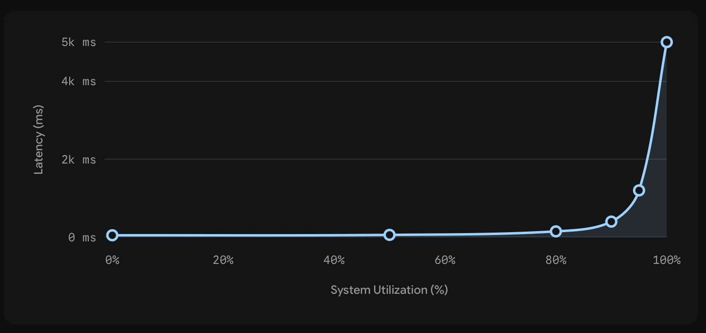
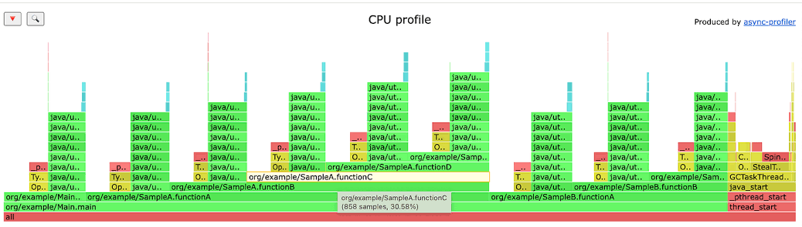
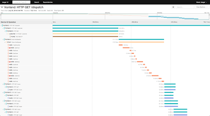

# Untitled

## Defining Performance and the Request Lifecycle

When a user says an application is "fast" or "slow," they are experiencing **latency**. To understand latency, we have to look at the exact mechanical chain of events that happens when a user interacts with a modern web app.

1. **User Action:** The user clicks a button in their Chrome browser.
2. **Network Travel (Inbound):** The browser fires off an HTTP request that physically travels across the internet to reach your backend server.
3. **Processing:** The server receives the request and starts processing the business logic.
4. **I/O Operations:** The server likely hits a database to read or write state. It might also call an external third-party API (like the **Resend** API to fire off an email).
5. **Network Travel (Outbound):** The server compiles a JSON response and sends it back across the internet.
6. **Client Rendering:** The browser receives the JSON, parses it, executes the required JavaScript, and paints the new UI (like a list of cards) on the screen.

Latency is the *total* time passed from step 1 to step 6.

**Why this matters (not stated in the source):** As a backend engineer, you only control Steps 3, 4, and part of 5. If your server processes a request in 10 milliseconds, but the user is on a slow 3G connection that takes 2 seconds to download the JSON, the user still perceives your app as "slow." This is why payload size matters just as much as database speed.

## The Problem with Average Latency and Percentiles

Latency is not a static number. In the real world, internet routing fluctuates, server loads vary, and caches warm up or expire. You might have one request finish in `50 milliseconds` because it hit a fast in-memory cache (like Redis) while the server was idle. The very next request might take `200 millconds` because the cache missed, requiring a database query, or because the server was concurrently processing 50 other requests.

If you measure 1,000 requests and calculate the average latency, you might get a result of `100 milliseconds`. **Averages are mathematically useless for performance engineering.**

Imagine a scenario where your system serves `1 million requests per day`.

- `99%` of requests complete in under `50 mconds`.
- `1%` of requests (an outlier group) take `5 seconds`.

The average hides that `1%`. But in a system processing 1 million requests, that `1%` represents **10,000 real users** staring at a loading spinner for `5 seconds` every single day.

To measure performance accurately, we use **Percentiles**:

- **P50 (The Median):** If your P50 is `400 milliseconds`, it means 50 percent of your users experience a latency of 400ms or better.
- **P90:** If your P90 is `900 millconds`, 90 percent of requests finish in 900ms or less. The slowest 10 percent suffer worse than 900ms.
- **P99:** If your P99 is `2 seconds`, 99 percent of users get a response in under 2 seconds. The remaining 1 percent experience 2 seconds or worse.

### Why We Care About the P95 and P99

Backend engineers focus aggressively on the P95 and P99 latencies rather than the P50. The requests sitting in the P99 bracket are rarely simple homepage loads; they are almost always the heaviest, most complex business operations.

These are the operations running complex multi-table SQL joins, synchronizing with third-party webhooks, or processing payments. Consequently, the users experiencing P99 latencies are usually your most valuable customers—the ones actively checking out, paying money, or running massive reports. If you ignore the P99, you are degrading the experience for the users generating your revenue.

## Throughput, Utilization, and The Exponential Curve

While latency is "how long a request takes," **Throughput** is "how many requests the system handles in a given time frame" (Requests Per Second or RPS).

Latency and throughput are deeply connected. Your server might boast a snappy `150 mconds` latency when handling `10 requests per second`. But if traffic spikes to `1,000 requests per second` (like during a Black Friday sale or a massive email marketing campaign), that latency might suddenly degrade to `2 seconds`.

To understand why, think of a local ice cream shop:

- **Low Utilization:** You walk in on a Sunday evening. The shop is empty. The worker takes your order and hands you ice cream in 2 minutes. Your request was served instantly because the resource (the worker) had 0 percent utilization.
- **High Utilization:** You walk in on Tuesday at lunch. The worker is still making ice cream at the exact same rate (2 minutes per cone). But there are 10 people in front of you. Your *perceived* wait time skyrockets because your request is sitting in a queue waiting for the resource to free up.

This concept maps directly to CPU and memory utilization. Utilization is the percentage of your system's capacity actively in use. At 0 percent, the system is idle. At 100 percent, the system is maxed out and on the brink of collapse.

The relationship between utilization and latency is **not linear**. It is exponential.

Think of a multi-lane highway:

- At **50% capacity**, cars flow smoothly at the speed limit. You can easily overtake.
- At **80% capacity**, you notice slowdowns. Changing lanes requires strategy.
- At **90% capacity**, traffic is unpredictable. A single driver braking causes a massive ripple effect (a traffic jam).
- At **100% capacity**, the road is a parking lot. Nothing moves.



### Traffic Bursts and Headroom

Because of this exponential decay at the top end, **you can never run production systems at 100% utilization**. Healthy systems are engineered to idle at `60 to 80% utilization`.

That remaining 20 percent buffer is strictly reserved as "headroom" to absorb traffic spikes. Internet traffic is not a metronome delivering exactly 10 requests every second; it comes in violent **bursts**. One minute you have zero requests, and the next you have 1,000. If your baseline average is sitting at 90 percent, a burst will instantly push you over 100 percent, causing the server to crash.

## Identifying Bottlenecks: Stop Guessing, Start Measuring

When a system gets slow, a specific component is failing to keep up. This is your **bottleneck**.

The biggest mistake junior engineers make is guessing the bottleneck based on textbook best practices. If the system is slow, they immediately assume the database is struggling and throw a caching layer in front of it. Or, they might blindly upgrade their database hardware (e.g., migrating from `Postgress version 16` to `Postgress version 18`), or aggressively add more horizontal server instances.

Sometimes you get lucky, and throwing hardware at the problem works. More often, you spend a week writing caching logic only to deploy it and realize the API is still just as slow.

Consider a debugging scenario for an endpoint fetching product details: `GET /products/{product ID}`.

1. The endpoint feels slow. You assume the database is the issue.
2. You spend a week writing a Redis caching layer.
3. You deploy. The API is still slow.
4. You finally stop guessing and add granular timing measurements to the code.

The logs reveal the truth:

- The actual database query took `10 milliseconds`.
- The new Redis cache query took `5 millconds`.
- A standard logging function that ships logs to a remote ElasticSearch server was executing **synchronously** and taking `500 milliseconds`.

**Why this matters (not stated in the source):** In synchronous execution, the thread stops and waits for a task to finish before moving to the next line of code. By shipping logs synchronously over a network, the entire API response was blocked, waiting on an external ElasticSearch server to acknowledge receipt of the log.

The database was never the problem. The real culprit could be JSON/XML serialization, network payload sizes, or a rogue external API call. **Never guess. Always measure.**

## Profiling and Observability Tools

To stop guessing, we use specific observability tools.

### 1. Profilers and Flame Graphs

A profiler attaches to your running application process and takes rapid samples of the call stack to see exactly which functions are consuming time and CPU cycles. Because reading raw profiler logs is overwhelming, we visualize this data using **Flame Graphs**.



Flame Graph showing call stack execution times. Source: Medium

In a flame graph, functions are stacked vertically to show the call hierarchy (who called whom), and the *width* of the bar represents the fraction of total time spent in that function. It makes it visually obvious if your app is spending 60 percent of its CPU time just serializing JSON objects instead of running your complex business logic.

**The limit of Profilers:** Profilers are phenomenal for **CPU-bound tasks** (heavy math, machine learning, image processing, complex business rules). However, typical backend SaaS applications are usually **I/O-bound** (Input/Output). They spend all their time waiting on the network, reading from a disk, waiting for a database to reply, or calling external APIs. CPU profilers often struggle to accurately measure I/O wait times.

### 2. Distributed Tracing

For I/O-bound architectures, we use Distributed Tracing (part of the broader Observability umbrella).



Distributed Tracing waterfall in Jaeger. Source: Jaeger

Tracing attaches a unique ID to a request the millisecond it enters your system. It tracks that request as it flows across different microservices, queues, caches, and databases. If `GET /products/5` takes 802ms, a trace will show you definitively that 2ms was spent in your API business logic, and 800ms was spent waiting on the database query.

## Database Bottlenecks and The N+1 Query Problem

Databases are the most common bottlenecks for good reason. They do the hardest work in computing: persisting data durably to a hard disk so it survives power failures, guaranteeing consistency during concurrent reads/writes, managing internal locking mechanisms, and searching across billions of rows. All of this takes time.

However, the most notorious, self-inflicted database performance issue is the **N+1 Query Problem**.

Imagine you are building a React frontend for a blog. The homepage needs to display a list of `20 blogs`. You hit your backend API to get the list, but the list payload doesn't include the author's name. So, for every single blog post in that list, you make an additional API call to fetch the author's details.

- 1 initial query to get the `N` items (20 blogs).
- `N` queries to get the author for each item (20 author queries).
- Total: `21 API calls` to render one page.

If your platform scales up and you want to show `1,000 blogs`, you are now making `1,001 API calls`.

**The Overhead Penalty:** It isn't just that you are asking for data 1,000 times. Every single query has a massive structural overhead. A request must travel the network, establish a TCP connection setup layer, be parsed by the database query planner, executed, and transmitted back. Even if the query itself is blazingly fast—say, `5 milliseconds`—running 1,000 of them sequentially takes `5,000 millconds` (`5 seconds`). Your user is staring at a blank screen for 5 seconds purely because of network overhead.

### The Solution: Bulk Fetching and ORM Awareness

The mathematical solution is simple: fetch in bulk. Instead of querying authors one by one, collect all 1,000 author IDs into an array and fetch them all in one single query. You reduce 1,000 requests down to 2.

In modern backend engineering, the N+1 problem usually happens internally on the server, entirely by accident, because of how Object-Relational Mappers (ORMs) abstract SQL.

Developers write code that looks like standard loops:

```jsx
// Looks like innocent code, but triggers N+1 to the database
posts = await db.select.posts(where: etc etc)

for post in posts:
    author = await fetch_author(post.author_id)
```

Because it feels like standard TypeScript or Python, it's easy to forget that the ORM is firing a physical network request to the database on every single iteration of that loop.

To fix this, you instruct your ORM to use SQL `JOIN` operations to pre-fetch foreign key relationships in bulk. Different ecosystems handle this explicitly:

- **Python/Django:** Use `.select_related()` (for foreign keys) or `.prefetch_related()` (for many-to-many).
- **Ruby on Rails:** Use `.includes()`.
- **TypeScript (Prisma, Drizzle):** Use structural nested selects or raw `.leftJoin()`.

**Why this matters (not stated in the source):** Most ORMs have a debug setting to print the raw SQL they generate to the console. You should always turn this on in development. If you hit an endpoint once and see a wall of 50 SQL queries rapidly printing to your terminal, you have an N+1 problem.

## Database Indexing Strategies

If your queries are optimized but the database is still slow, the problem is likely missing indexes.

Imagine a massive physical library with 1 million books scattered across floors and shelves with absolutely no catalog system. If someone asks for all books by "John Green," you have to walk the entire building, check the author of every single book, and put the matches in a box. It would take 3 days. In database terms, this is a **Sequential Scan** (or **Full Table Scan**). The engine looks at every single row to see if it matches the `WHERE` clause. Scanning 1 million rows might take `4 seconds`—which is eternity in computing.

If the library maintained a catalog sorted alphabetically by author, you could jump straight to "G", find "John Green", get the exact shelf pointers, and retrieve the books in 2 minutes. This is a **Database Index**.

Under the hood, relational databases typically implement indexes using a **B-Tree** (Balanced Tree) data structure. The B-Tree maintains a strictly sorted copy of the target column's data alongside a pointer to the original row on the disk. Because the data is pre-sorted, the database can use binary search algorithms to navigate the tree instantly, dropping that 4-second query down to `40 milliseconds` (or `under 100 millconds`).

### The Cost of Indexes

You cannot simply index every column to make everything fast. Indexes are not free:

1. **Storage Cost:** A B-Tree is a physical data structure. Storing a sorted copy of a massive column takes up serious disk space.
2. **Write Penalty:** Every time you perform an `INSERT`, `UPDATE`, or `DELETE` on your primary table, the database must synchronously rewrite and rebalance the B-Tree index to keep it in perfect sync. If you index 20 columns, a single row insertion triggers 20 separate tree updates. Your writes will slow to a crawl.

### How to choose what to index

Primary keys (like the `ID` column) are indexed automatically by Postgres by default. Very obvious foreign keys (like `author_id` in a `books` table) should be indexed during the initial database migration.

For everything else, you use observability data to prove an index is needed. If tracing shows a query is slow, you grab the raw SQL and prepend it with the `EXPLAIN ANALYZE` command in your database console.

The database will output its internal execution plan. If it says `Seq Scan` (Sequential Scan) on a table with millions of rows, you've found your missing index. Once you add the index and run `EXPLAIN ANALYZE` again, it should proudly display `Index Scan`, proving the problem is solved.

### Advanced Indexing: Composite and Covering

- **Composite Index:** An index spanning multiple columns (e.g., `user_id, created_at`). **Order matters strictly here.** A composite index on `(user_id, created_at)` will speed up queries filtering by *both*, and queries filtering by *just* `user_id`. But it is completely useless for queries filtering by *just* `created_at` (because the tree is sorted primarily by user).
- **Covering Index:** If a dashboard constantly asks for just the `name` and `id` from a 100-column `departments` table, you can create a covering index on the `name` column. When queried, the database realizes it already has all the requested data directly inside the index structure, allowing it to return the result without ever fetching the actual table row from the disk.

## Connection Cost and Database Pooling

As your traffic scales, you will encounter connection limits. Communicating with a database is not like calling a simple function. Creating a connection is a heavy, resource-intensive process.

Every time a backend server opens a new database connection, it must:

1. Execute a TCP network 3-way handshake (SYN, SYN-ACK, ACK).
2. Perform authentication.
3. Negotiate TLS/encryption algorithms (Private/Public keys).
4. Establish a stateful session.
5. Allocate several Megabytes (MBs) of dedicated RAM on the database server to hold that connection open.

If your backend opens a brand-new connection, runs a 5ms query, and immediately closes it, the time spent setting up and tearing down the connection will dwarf the query time.

Furthermore, because each connection reserves RAM, databases have strict hard limits. A standard Postgres configuration might limit you to `400 to 500` concurrent connections. If a Black Friday spike sends 10,000 requests, and your code tries to open 10,000 DB connections, the database runs out of RAM and crashes instantly.

### Connection Pooling Architecture

To fix both the latency overhead and the crash risk, we use a **Connection Pool**.

A pool is a middleman. Instead of creating and destroying connections constantly, the pool spins up a fixed set of connections (say, 50) and leaves them permanently open. When your backend code needs to query the database, it "borrows" a connection from the pool. It runs the query, and instantly returns the connection to the pool to be reused by the next request.

**Internal vs. External Pooling** Modern database drivers support **Internal Pooling** (where the Node.js or Python process itself maintains a pool in memory). This is fine for small apps, but becomes dangerous when combined with Kubernetes auto-scaling (Horizontal Scaling).

Imagine you configure an internal pool of `150 connections` per server instance.

| Auto-scaling state | Math | Total DB Connections Attempted | Result |
| --- | --- | --- | --- |
| **Normal Traffic** | 1 server × 150 pool limit | 150 connections | DB handles it fine. |
| **Traffic Spike** | 3 servers × 150 pool limit | **450 connections** | DB Limit is 300. **Database crashes.** |

Because the servers don't talk to each other, they don't realize their combined internal pools have exceeded the database's global limit.

To solve this, senior engineers deploy **External Poolers**, such as **PgBouncer** for Postgres. PgBouncer runs as an entirely separate infrastructure component. It maintains a strictly enforced external pool of `250 or 300 connections` to the database. All 10 of your auto-scaled backend servers connect to PgBouncer, not the database. PgBouncer seamlessly multiplexes their requests through its safe pool, ensuring the database is never overwhelmed, regardless of how many application servers spin up.

## Caching: The Ultimate Detour

If queries are optimized, indexes are perfect, and connection pooling is active, but the DB is *still* the bottleneck (say, taking `800 millconds`), it's time for caching.

Caching takes the result of a computationally expensive operation and saves it in a hyper-fast storage medium. The next time the request comes in, the server takes a detour, grabs the pre-computed result from the cache in `50 mconds`, and bypasses the 800ms database operation entirely.

### The Invalidation Problem

Caching is easy. Keeping the cache accurate is famously brutal. ("There are only two difficult problems in programming: naming things, and cache invalidation").

If a user updates their profile in the database, the cached version is now instantly obsolete (stale). If you don't remove it, the user will refresh their page and see their old data. There are two ways to solve this:

1. **Time-Based Expiration (TTL - Time To Live):** You tell the cache, "Delete this data automatically after `5 minutes` or `10 minutes`." The difficulty is choosing the right time. If you set it to `7 days`, you risk serving stale data for a week.
2. **Event-Based Invalidation:** Every single time your backend code updates a record in the database, you explicitly write a line of code to delete that exact record's key from the cache. The next read request will find an empty cache, forcing it to fetch the fresh data from the database. The downside? If a developer forgets to add that invalidation line in even one edge-case API endpoint, stale data leaks through permanently.

### Local vs. Distributed and Tiered Caching

- **Local Caching:** Saving the cache inside the physical RAM of the application server (like a Python dictionary or Node Map). It is blindingly fast (`2 to 3 milliseconds`), but if you have 10 servers, you now have 10 isolated caches. If Server A updates the database, Servers B through J still hold the old stale cache in their local memory. **Cache inconsistency** ensues.
- **Distributed Caching:** Using a dedicated external caching server like **Redis**, Memcached, or **Valkey**. All 10 application servers point to the single Redis instance. Inconsistency is solved, but because it's a separate server, you now pay a network roundtrip penalty (e.g., `50 mconds`).

Large systems combine them into **Tiered Caching**. The absolute "hottest" (most frequently requested) data is kept in the 2ms local cache. If there's a miss, it checks the 50ms distributed Redis cache. If that misses, it hits the 800ms database.

### Caching Patterns

When and how does data actually enter the cache?

- **Cache-Aside (Lazy Loading):** The most common pattern. The app asks the cache. If it misses, the app asks the database, takes the result, saves it into the cache, and returns it to the user. On an update, the app updates the DB and deletes the cache key.
- **Write-Through:** On an update, the app updates the DB *and* updates the Cache simultaneously. You never suffer a cache miss, but write operations take slightly longer because you are writing to two systems over the network synchronously.
- **Write-Behind:** On an update, the app *only* updates the fast Cache and instantly returns "Success" to the user. Then, asynchronously in the background, it flushes that data to the slow database. **Why this matters (not stated in the source):** This makes writes incredibly fast, but if the cache server crashes before the async flush completes, the data is permanently lost despite the user receiving a success message.

A system's caching success is measured by the **Cache Hit Rate**. A `90%` hit rate is excellent (90% of requests avoided the DB). A `20%` hit rate is terrible and usually means your TTL is too short, your cache RAM size is too small (causing it to evict good data to make room), or you fundamentally misunderstood your users' data access patterns.

## The Two Paths of Infrastructure Scaling

Eventually, optimizing code and databases isn't enough. You simply need more computing power. There are two fundamental ways to scale hardware.

### 1. Vertical Scaling (Scaling Up)

Vertical scaling means making a single machine physically larger and more powerful. You replace your current server with a bigger one:

- CPU cores scale from `2, 4, 8` up to `32`.
- RAM scales from `2 GB` up to `4 GB, 8 GB, 16, 32`, or `96 GB`.
- Storage scales from `30 GB` to `300 GB` to `1 TB` (using fast NVMe SSDs).
- Network capacity upgrades to `10 Gbps`.

**Pros:** It is beautifully simple. The architecture doesn't change. Your code doesn't change. If you double the CPU and double the RAM, you roughly double your capacity. It avoids the massive operational overhead of managing distributed systems.

**Cons:**

- **The Hard Ceiling:** You will eventually hit the absolute hardware limit of what cloud providers like AWS or GCP offer. Once you are on the biggest machine possible, you can no longer scale vertically.
- **Single Point of Failure (SPOF):** If your massive beast of a server crashes due to a library bug, your entire application is 100% unavailable for hours until it restarts.
- **No Geographic Distribution:** A single physical server lives in one physical location (e.g., the USA). If 40% of your users are in India, they will forever suffer the speed-of-light latency penalty of transmitting requests across the ocean.

### 2. Horizontal Scaling (Scaling Out)

Horizontal scaling means adding *more instances* of medium-powered servers to share the load.

**Pros:** The math scales infinitely. If one server handles 1,000 requests, five servers handle 5,000. You never hit a hard hardware limit. If one server crashes, the other four seamlessly take over (Redundancy). You can put servers in the US, Europe, and India to slash geographic latency.

**Cons:** It introduces the punishing complexity of distributed computing. To spread the traffic, you must introduce a new infrastructure component called a **Load Balancer**, and choose a routing algorithm. Because requests might hit Server A on Monday and Server B on Tuesday, you have to solve distributed state—how do you keep all servers perfectly in sync? What happens when the internal network connecting them fails? If the servers lose connection to each other, how do you prevent them from making conflicting decisions (Split-brain)?

Distributed systems do not eliminate problems; they trade the hardware limitations of vertical scaling for the software complexity of horizontal synchronization.