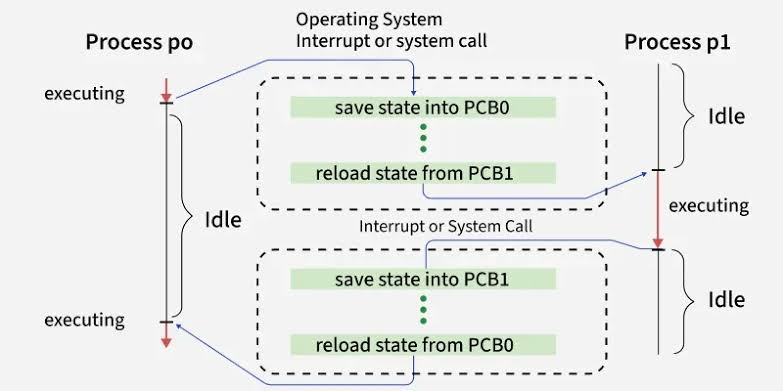
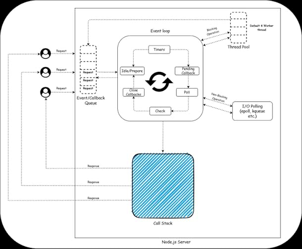

# Untitled

## The Naive Server and the Need for Concurrency

If you build an HTTP-based backend web server that processes requests **synchronously**—executing code line-by-line without any concurrency—it can only handle one browser request at a time. If user A makes a request, users B through Z (say, a thousand users) must either wait their turn or get an error that the server is busy. In production, this is impossible.

Different programming languages and runtimes (like **NodeJS, Python, Rust, or Go**) provide different ways to express the requirement to do multiple things at once. Usually, developers learn keywords like **`async`**, **`await`**, or **threads** from documentation. However, understanding the mechanical realities behind these abstractions helps you debug systems and make architectural decisions.

## Anatomy of an API Call and the Cost of Waiting

A typical backend request travels through standard architectural boundaries: a **routing layer**, a **service layer**, a **handler layer**, and a **repository layer**. Eventually, it hits the database.

When you execute a query, you are bound by network physics. The source breaks down the typical wait times for a database response:

- **1 to 2 milliseconds:** Database is on your local network (localhost).
- **20 to 30 milliseconds:** Database is deployed in a different Availability Zone (AZ) in production.
- **90 to 100 milliseconds:** Database is in a completely different geographical region.

**The Math of Waste:**

While the server waits for that 100ms response, the CPU is completely **idle**.

A modern CPU can execute roughly **3 billion instructions per second** (or 3 million instructions per millisecond). If your server sits idle for 100 milliseconds waiting for a query to return, it has just missed the opportunity to execute **300 million instructions**. Because the naive server only processes one request at a time, it executed zero instructions during that window.

**The 95% Idle Problem:**

A mid-to-complex API call usually involves 3 to 5 database queries and external services (like sending emails or checking a **Redis** cache).

- If an API call makes 5 external network operations, averaging 50ms each, it spends **250 milliseconds waiting**.
- The actual CPU processing (parsing JSON, validating data) might only take **10 milliseconds**.
- Result: Your server's CPU and memory resources are idle **95% of the time**.

This waiting period is categorized as **I/O (Input/Output)**—any operation interacting with the network, file system, standard input (keyboard), or standard output (display). In a typical backend application, more than 70% of execution time is spent purely on I/O.

> **Why this matters (not stated in the source):** In cloud environments, you pay for CPU time and memory. If your server is idle 95% of the time but blocking new requests, you are forced to spin up dozens of expensive duplicate servers just to handle waiting, heavily inflating infrastructure costs.
> 

## Parallelism vs. Concurrency

These terms are often confused but describe fundamentally different mechanical realities.

- **Parallelism:** Executing multiple instructions at the *exact same moment*. This requires hardware-level support (at least two physical CPU cores). Core 1 processes an instruction for Request A at the exact same millisecond Core 2 processes an instruction for Request B.
- **Concurrency:** Dealing with multiple things at once by structuring the program to start, pause, and resume tasks. It can be achieved on a **single CPU core**.

### Concurrency on a Single Core (Visualized)

Imagine a timeline broken into 10ms chunks, processing two requests (Request A and Request B) on one CPU core:

1. **0-5ms:** Request A arrives. The CPU performs routing logic, JSON deserialization, and validation.
2. **5ms:** Request A makes a database query. It now needs to wait 40ms for the I/O response. Request A *relinquishes* the CPU.
3. **5-15ms:** The OS/Runtime Scheduler immediately gives the CPU to Request B, which has been waiting. Request B does heavy recursive validation for 10ms.
4. **15ms:** Request B makes its own database query and starts waiting (for 35ms). It relinquishes the CPU.
5. **15-40ms:** The CPU is free to handle other tasks like logging messages to standard output, sending telemetry data, or running background jobs.
6. **40ms:** The database returns the response for Request A.
7. **50ms:** The scheduler finally hands the CPU back to Request A to process the database bytes and send the HTTP response.

Both requests were "in progress" simultaneously from the client's perspective, but at any given microscopic time slice, the CPU was only executing one instruction.

## I/O-Bound vs. CPU-Bound Workloads

- **I/O-Bound:** Tasks that spend most of their time waiting for external resources (databases, file systems, external APIs). They require **concurrency** to keep the CPU busy with other tasks while waiting.
- **CPU-Bound:** Tasks that spend their time doing actual computation, crunching numbers, and executing instructions on the core.
    - *Light examples:* JSON deserialization, basic validation (finished in 1-2ms).
    - *Heavy examples:* Image processing, matrix multiplication (graphics), or **encryption** (e.g., verifying a JWT token in an authentication middleware).

For heavy CPU-bound tasks, concurrency doesn't help much because the CPU is actually being used. You need **parallelism** (more cores) to finish the math faster. However, backend applications are overwhelmingly I/O-bound.

## Concurrency Model 1: Operating System Threads

Every concurrency primitive in modern languages builds on either OS threads or event loops.

A **thread** is an independent piece of execution managed directly by your Operating System. When the OS creates a thread, it allocates:

1. **A Stack:** Memory to keep track of function calls (e.g., `main()` calling `get_users()`) and local variables (e.g., `let a = 3`).
2. **An Instruction Pointer:** A tracker pointing to the exact line of code currently executing, so the OS knows where to resume later.
    
    
    OS Context Switching between Threads/Processes
    



### The OS Scheduler and Preemptive Scheduling

Threads are controlled by the **OS Scheduler**. It uses **preemptive scheduling**, meaning it forces threads to stop whether they are finished or not. It gives each thread a strict time slice (e.g., 2 milliseconds) to use the CPU. When 2ms is up, the scheduler pauses the thread, saves its state, and gives the CPU to the next thread.

*(Side note: The source recommends the book **"Operating Systems: Three Easy Pieces"** for a deep dive into scheduler algorithms).*

### Blocking and Shared Memory

When a thread encounters a **blocking operation** (like a TCP network call to a database), it explicitly tells the OS it cannot continue. The OS marks the thread as "blocked," pulls it off the CPU, and immediately schedules a different thread.

Threads differ from OS Processes in how they handle memory:

- **Process Isolation:** Process 1 cannot see Process 2's memory for security reasons.
- **Thread Sharing:** Thread 1 and Thread 2 *inside the same process* share the same memory space (the Heap). If Thread 1 creates an object or a Go `struct`, Thread 2 can access it directly using a **pointer** (the memory address). This makes communication incredibly fast, but highly dangerous (explained later).

### The Three Overheads of Threads

Relying on a "one thread per HTTP request" model fails at high scale because OS threads are expensive:

1. **Memory Overhead:** On Linux, a thread's stack is allocated around **8 Megabytes** of virtual memory (physical space is mapped as needed, but the reservation exists). If a traffic spike hits and your framework spins up **10,000 threads** for 10,000 requests, you immediately consume **8 to 9 Gigabytes** of memory just for thread management, likely crashing the server.
2. **Creation Overhead:** Creating a thread requires a **system call** to the OS kernel. The kernel must allocate data structures, set up the stack, and register it with the scheduler. This takes microseconds to milliseconds.
3. **Context Switch Overhead:** When the scheduler switches from Thread A to Thread B, it must save Thread A's CPU registers, update bookkeeping, fetch Thread B's saved registers, and restore them. This takes **1 to 10 microseconds**. If you have 4 CPU cores juggling 1,000 threads, the OS spends milliseconds purely on "maintenance work" rather than executing your program.

## Concurrency Model 2: The Event Loop

Instead of spinning up heavy OS threads to handle multiple requests, the Event Loop model uses a **single thread**.

NodeJS Single-Threaded Event Loop Architecture



Because there is only one thread, there is no OS-level context switching and no gigabytes of wasted stack memory. The primary trade-off is the golden rule of event loops: **You can never block the event loop.**

If you execute a CPU-bound task that takes 100ms (like video rendering or heavy ML workloads) on the event loop, the entire server stops. All other 1,000 requests are frozen for 100ms because there is no OS scheduler to preemptively pause the heavy task.

### How it Works (OS level)

Event loops rely on special OS-level functions that monitor network connections asynchronously:

- **`epoll`** in Linux
- **`kqueue`** in macOS
- (IOCP in Windows, implicitly referenced)

When a request needs to wait for a database, the code registers a **callback** (a piece of logic to run *later*) and immediately hands control back to the event loop. The loop continually iterates. On every iteration, it asks `epoll`: *"Are any of my pending I/O operations complete?"* When `epoll` says yes (e.g., "Socket B is now readable"), the event loop grabs the callback associated with that socket and executes it.

### Code Traces: Database Queries in Both Models

**Threading Model (Python pseudo-code):**

```python
def handle_request(user_id):
    # Sends bytes over TCP, calls read() on the socket.
    # The OS sees the thread block on read(), and swaps it out.
    user = db.get_user(user_id) # <--- Blocking operation

    # OS wakes thread up when bytes arrive
    return user
```

**Event Loop Model (Pre-ES6 JavaScript Callback Hell):**

```jsx
function handleRequest(userId, sendResponse){
    // Sends bytes, registers an anonymous function, and immediately returns control to the loop.
    db.query("SELECT * FROM users WHERE ID = ?", userId, function(error, result){
        // This callback sits in memory until epoll says the DB socket is ready.
        sendResponse(result);
    });
}
```

If you had to do 5 sequential queries, you had to nest 5 callbacks inside each other, creating unreadable code.

**Event Loop Model (Modern ES6 `async/await`):**

```jsx
async function handleRequest(userId){
    // Syntactic sugar. Everything after 'await' is secretly packaged as a callback.
    let user = await db.query("SELECT * FROM users WHERE ID = ?", userId);
    return user;
}
```

The `async/await` primitives are just syntactic sugar over callbacks. When you write `await`, you explicitly tell the language: *"Hand control of the CPU back to the event loop. When the network responds, resume this function exactly here."*

## Concurrency Model 3: Virtual Threads (Go Routines)

Languages like **Go** (and modern Java) use a hybrid approach. They don't use the single-threaded event loop, but they also don't use heavy OS threads directly. They use **Virtual Threads**, known in Go as **Goroutines**.

When you write a backend in Go, the standard library (`net/http`) automatically creates a brand new goroutine for every single HTTP request using the **`go`** keyword. We couldn't do this with OS threads because of memory limits, but Goroutines are incredibly lightweight.

### The M:N Scheduler

Go bypasses the OS scheduler and ships with its own **Go Runtime Scheduler** embedded in the language.

1. When you start a Go program, it checks a flag called `GOMAXPROCS` (usually equal to your physical CPU cores, let's say 4).
2. It creates exactly 4 real OS threads (M1, M2, M3, M4).
3. As your server receives thousands of requests, it spins up thousands of Goroutines.
4. The Go Scheduler acts as a middleman, pushing these thousands of Goroutines (M) onto the queues of the 4 OS threads (N).

When `Goroutine 1` hits a blocking database call (`db.Query("SELECT * FROM users...")`), the Go Scheduler steps in. It pauses `Goroutine 1`, detaches it from the OS Thread, and immediately maps `Goroutine 2` onto that OS Thread.

Because the Go Runtime handles the context switch, it is essentially just a **pointer switch** in memory. It skips the heavy kernel system calls and register swapping required by standard OS threads. You can run millions of goroutines concurrently without crashing.

## Async Functions as State Machines

To deeply understand how a language runtime actually pauses and resumes `async/await` code without OS threads, you have to look at the compiler. The compiler transforms your async function into a **State Machine**.

Imagine this function:

```jsx
async function fetchUserData(userId){
    let user = await db.getUser(userId);
    let orders = await db.getOrders(userId);
    return { user, orders };
}
```

Under the hood, the runtime converts it into something looking like this:

```jsx
function fetchUserData(userId){
    let state = 0;
    let user, orders;

    function step(dbResult){
        switch (state) {
            case 0:
                state = 1; // transition state
                // Start DB call, pass 'step' as the callback
                db.getUser(userId).then(step);
                return; // Release CPU to event loop
            case 1:
                user = dbResult; // Save result from previous callback
                state = 2; // transition state
                db.getOrders(userId).then(step);
                return; // Release CPU
            case 2:
                orders = dbResult;
                return { user, orders };
        }
    }
    return step(); // Kick off the machine
}
```

This is **why you can only use `await` inside an `async` function**. The `async` keyword is a flag telling the compiler to completely rewrite the function body into this hidden switch-statement state machine. If you block the event loop with heavy math, the state machine can never transition from `state = 0` to `state = 1`.

## The Danger of Concurrency: Shared State

Whether you use OS threads, Event Loops, or Goroutines, concurrency introduces problems anytime multiple tasks try to access **shared memory**.

### The Lost Update Problem (Race Condition)

Imagine a global variable `counter = 0`. Two different threads (Thread A and Thread B) try to increment it simultaneously.

Incrementing is not a single action; it takes three steps:

1. Read current value into a CPU register.
2. Add 1 to the register.
3. Write the register value back to the variable in memory.

**The failure timeline:**

- **ms 1:** Thread A reads `counter` (value: 0).
- **ms 2:** Thread B reads `counter` (value: 0).
- **ms 3:** Thread A adds 1 to its register (register: 1).
- **ms 4:** Thread B adds 1 to its register (register: 1).
- **ms 5:** Thread A writes 1 to `counter`.
- **ms 6:** Thread B writes 1 to `counter`.

Both threads successfully ran, but the final value is `1`, not `2`. Thread A's update was completely lost. This is a **Race Condition**.

### Race Conditions in Single-Threaded Event Loops

Developers often assume that because NodeJS (or Python `asyncio`) is single-threaded, race conditions don't exist. This is false.

Look at this bank balance logic:

```jsx
let balance = 100;

async function withdraw(amount){
    if (balance >= amount) {                 // Check
        await processWithdrawalInDB();       // Yield CPU
        balance = balance - amount;          // Update
    }
}
```

If two requests to withdraw $100 arrive almost simultaneously:

1. **Request 1** checks `if (100 >= 100)`. It is true. It hits `await` and yields the CPU to the event loop while the DB processes.
2. **Request 2** gets the CPU. It checks `if (100 >= 100)` because `balance` hasn't been updated yet. It is true. It hits `await` and yields the CPU.
3. **Request 1**'s DB call finishes. It resumes and updates `balance = 100 - 100 = 0`.
4. **Request 2**'s DB call finishes. It resumes exactly where it left off, and blindly updates `balance = 0 - 100 = -100`.

The logic failed, resulting in an invalid `-100` state, despite running on a single thread. The race condition happened because the execution was interleaved at the `await` boundary.

### Solutions

1. **Locks / Mutexes:** In a threading model (like Python's `threading` library), you wrap the vulnerable code in a lock (Mutual Exclusion). When Thread A acquires the lock, Thread B is physically blocked from reading the variable until Thread A releases the lock.
2. **Channels:** In Go, the modern approach is avoiding shared memory entirely. Instead of two goroutines reading/writing a global variable, they pass messages through a pipe (a Channel) to a *single* dedicated goroutine whose only job is to update the variable sequentially.