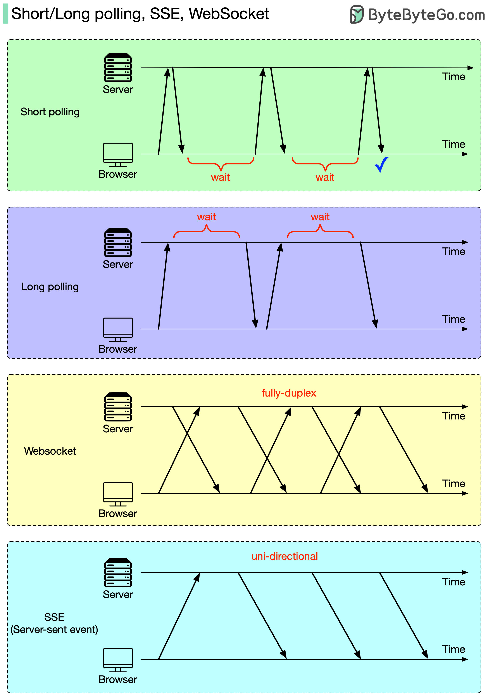
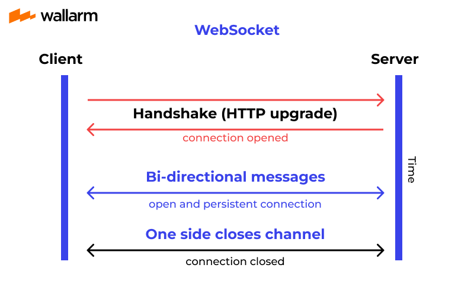
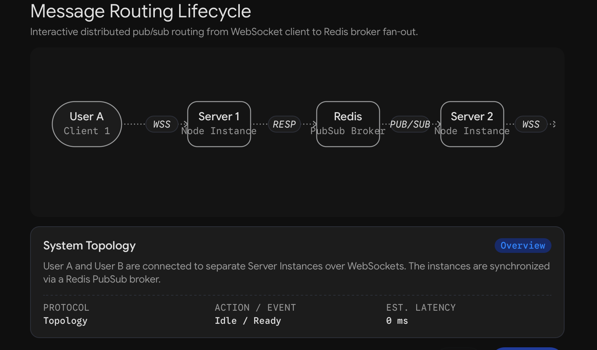

# Untitled

## 1. The HTTP Limitation: Servers Can't Speak First

Every standard backend you have built so far—authentication, CRUD endpoints, background jobs—has followed a strictly unidirectional trigger: **the browser asks a question, and the server answers it.**

Imagine you are building a real-time task management board (like Trello or Jira). User A and User B have the same board open on different continents. User A drags a task from "To-Do" to "In Progress." User B needs to see that move instantly.

The immediate roadblock is that HTTP is a client-initiated protocol. The server has no native mechanism to reach out to User B's browser and say, "Hey, a task moved." It can only reply when User B's browser explicitly asks for an update.

## 2. Short Polling: The Brute Force Approach

If the server cannot speak first, the most intuitive fix is to make the client ask repeatedly. In **Short Polling**, the browser runs a continuous loop, asking the server every 3 seconds: *"Has anything changed on board 412?"*

Most of the time, the server checks the database and returns a `200 OK` with an empty response or a "no change" flag. When User A finally moves a task, the server catches this on the next 3-second cycle and tells User B to re-fetch the board.

**Why this breaks at scale:**

1. **The Delay:** Pure arithmetic dictates that your average delay is half your polling interval. At 3 seconds, a user waits an average of 1.5 seconds to see a change.
2. **Resource Waste:** If you try to fix the delay by dropping the interval to 1 second, 10,000 active users will hammer your server with 10,000 HTTP requests per second. Every single request must traverse your load balancer, execute authentication middleware, write logs, and query the database—only to usually reply, "Nothing changed." You are paying your cloud provider for the *medium* (the empty requests), not the *value* (the actual data changes).
3. **Mobile Battery Drain:** On mobile devices, executing a network request wakes up the cellular radio. Waking the radio is one of the most battery-intensive actions a phone can perform. Continuous polling drains user batteries and data plans rapidly.

## 3. Long Polling: Holding the Line (RFC 6202)

To reduce the waste of short polling, engineers developed **Long Polling**.

*Real-life comparison:* Instead of calling a restaurant every 5 minutes to ask if your table is ready and them hanging up (Short Polling), you call the restaurant, and they just set the phone down on the counter, leaving the line open. They only pick up and talk when your table is finally ready.

In technical terms, the browser sends an HTTP request, but the server intentionally delays the response. It holds the TCP connection open. The moment an event occurs (e.g., a task is moved), the server writes the response and completes the HTTP request. The browser receives the data, processes it, and immediately opens a *new* long-polling request to wait for the next event.

**The flaw:** As documented in RFC 6202, there is a physical gap between the server closing the request and the browser opening a new one. During that window (which involves processing time and network transit), the server has no open connection to the client. If another event happens during that microsecond gap, it might be delayed or dropped entirely.

Evolution of Real-Time Protocols. Source: ByteByteGo

## 4. Server-Sent Events (SSE): The Infinite Response

If Long Polling's flaw is closing the connection, the next logical step is simple: **never finish the response.**

**Server-Sent Events (SSE)** uses standard HTTP. The browser makes a normal `GET` request. The server replies with an HTTP `200 OK`, but it includes a specific header: `Content-Type: text/event-stream`.

By sending this header, the server tells the browser, "I am going to keep streaming text to you indefinitely; do not close the connection." The server can then push discrete text blocks (events) down that open pipe whenever it wants.

**The SSE Data Format:** SSE is highly standardized in browsers and expects a specific plaintext format with four optional fields per event:

- `id`: A unique identifier for the event.
- `event`: The type of event (e.g., `task_moved`, `task_deleted`).
- `data`: The actual JSON payload to render.
- `retry`: Tells the browser how many milliseconds to wait before attempting to reconnect if the connection drops.

**Built-in Reconnection (Last-Event-ID):** Because SSE is a browser standard, you don't have to write JavaScript to handle disconnects. If the user drives through a tunnel and loses signal, the browser automatically reconnects when the signal returns. Crucially, it automatically sends an HTTP header called `Last-Event-ID` containing the `id` of the final event it successfully received. The server reads this and instantly pushes all the events the user missed.

**Is SSE a toy?** No. People often assume WebSockets are the only "professional" option, but SSE is robust. Uber's push platform for dispatching trips to drivers is built on SSE. LinkedIn's typing indicators and read receipts use SSE. When you watch an AI language model generate text one word at a time in your browser, that streaming is powered by Server-Sent Events.

## 5. WebSockets: True Bidirectional Communication

The core limitation of Server-Sent Events is that it is **unidirectional**. The server can talk to the browser endlessly, but if the browser wants to send a message back (e.g., the user dragging a task), it must fire off a completely separate, standard HTTP `POST` request.

For full, two-way (bidirectional) communication on a single open connection, we need **WebSockets**.

### The Handshake (HTTP Upgrade)

WebSockets are powerful because they start out disguised as standard HTTP. This means they pass cleanly through corporate firewalls, proxies, and load balancers that only understand HTTP traffic.

1. The browser sends a standard HTTP `GET` request, but includes the headers: `Upgrade: websocket` `Sec-WebSocket-Key: [16 random bytes, Base64 encoded]`
2. The server acknowledges the request. To prove it is an active WebSocket server (and not just a dumb cache accidentally replaying an old response), it takes the client's `Sec-WebSocket-Key`, concatenates it with a globally fixed magic string defined in the WebSocket specification, hashes the whole thing using SHA-1, Base64 encodes it, and sends it back in a `Sec-WebSocket-Accept` header alongside an HTTP `101 Switching Protocols` status code.
3. Once the browser verifies the hash, the HTTP protocol is entirely discarded. The TCP socket stays open, but the communication shifts to the WebSocket protocol.

The WebSocket HTTP Handshake. Source: Wallarm

### WebSocket Frames and Efficiency

In HTTP, every request carries hundreds of bytes of heavy text headers (cookies, user agents). In WebSockets, data is sent in lightweight chunks called **frames**.

A frame header is incredibly efficient, heavily utilizing bit-level packing:

- **FIN (1 bit):** Indicates if this is the final piece of a fragmented message.
- **Opcode (4 bits):** Dictates the frame type. `1` is Text, `2` is Binary, `8` is Close, `9` is Ping, `10` is Pong, and `0` means Continuation.
- **Mask (1 bit):** Indicates if the payload is scrambled.
- **Payload Length (7 bits):** If the data is under 126 bytes, this field is just the length, making the entire header only **2 bytes** long. If it's larger, it uses 126 or 127 as flags to read the next 2 or 8 bytes to get the full length.

### Masking and Cache Poisoning

Every single frame sent from the *browser* to the *server* must be masked. The browser generates a random 4-byte key and XORs (scrambles) the payload against it.

**Why this matters (not stated in the source):** It is not for encryption—the 4-byte key is sent in plain text right next to the data. It exists exclusively to prevent **Caching Proxy Poisoning**. Years ago, attackers realized they could send a WebSocket message containing raw text that looked exactly like a forged HTTP `GET` request for a popular script (like Google Analytics). A dumb proxy sitting in the middle of the network might not realize the connection upgraded to WebSockets. It would see the fake `GET` string passing through the wire, assume it was an HTTP request, intercept the server's response, and cache the attacker's malicious payload as the official Google Analytics script.

By forcing the browser to XOR mask every payload with a random key that JavaScript cannot predict, attackers cannot control the exact bytes that hit the network wire, making it mathematically impossible to forge recognizable HTTP requests inside the stream.

### Ping, Pong, and Dead Connections

Because WebSockets operate over TCP, you encounter a silent killer: dead connections. If a mobile user walks into an elevator and loses signal, their phone doesn't politely send a "disconnect" message. It just vanishes.

To the server's operating system, an idle connection (no one is typing) and a dead connection (the user lost signal) look exactly the same—pure silence. If the server doesn't clean these up, it will eventually run out of memory holding onto ghost connections.

To fix this, WebSockets use heartbeats via Opcodes 9 (Ping) and 10 (Pong). The server periodically sends a Ping frame. The standard mandates that the client *must* immediately reply with a Pong. If 30 seconds pass without a Pong, the server assumes the connection is dead, aggressively closes the socket, and reclaims the memory.

## 6. Pushing Server Limits: File Descriptors

When you try to scale WebSockets on a single machine, you hit operating system limits long before you hit CPU bottlenecks.

In Linux and Unix systems, *everything is a file*—including network sockets. To track open connections, the kernel assigns a **File Descriptor (FD)** to each one. Therefore, the maximum number of WebSockets you can hold is strictly limited by the OS limit on open files.

If you run `ulimit -n` on a standard Linux box, it often returns `1024`. If you spin up a server and fire connections at it, it will hard-crash at exactly 1017 connections (1024 minus 7 overhead descriptors for stdin, stdout, stderr, and the listening socket).

**The Language Factor:** If you write your backend in Node.js, Python, or Java, you will hit this 1,024 limit and the process will throw a "Too many open files" error. However, if you write it in **Go**, the Go runtime intelligently checks this limit on startup. Recognizing that 1024 is an artificially low legacy constraint (originally required by old `select` syscalls which Go doesn't use), the Go runtime automatically reaches out to the kernel and quietly raises its own File Descriptor limit to over 1,000,000.

## 7. Pushing Client Limits: The 65k Port Myth

Once you bypass the file descriptor limit, your load-testing script will eventually crash around 28,000 connections with a `cannot assign requested address` error.

There is a widespread myth that a server can only hold 65,000 connections total because there are only 65,535 TCP ports available. **This is false.**

A TCP connection is not identified by a single port. It is identified by a 4-tuple: `[Source IP, Source Port, Destination IP, Destination Port]`

Your server only uses **one** Destination IP and **one** Destination Port (e.g., `443`). As long as incoming connections have a unique combination of Source IP and Source Port, the server can hold millions of them.

The limit you hit during load testing is a **client-side limitation**. Your load-testing machine has a single IP address. When it dials out, the kernel assigns it an ephemeral (temporary) outgoing port. By checking the kernel config, you'll see Linux restricts ephemeral ports to a specific range (often `32768` to `60999`—roughly 28,000 ports).

To simulate 75,000 concurrent users for a load test, you do not need a bigger server. You just need to assign three different local IP addresses to your load-testing client, allowing it to utilize 25,000 outgoing ports on each IP.

## 8. The Final Bottleneck: RAM

Once OS limits are bypassed, the true ceiling for concurrent WebSockets on a single machine is pure RAM.

When benchmarking a Go server holding 75,000 idle connections, memory usage hit ~722 MB. By dividing that out, we find each open WebSocket connection costs roughly **9,750 bytes (~9.7 KB)** of heap memory.

**Why this matters (not stated in the source):** In Go, allocating a dedicated Goroutine (a lightweight thread) to actively read and write to every single socket consumes buffer memory. To squeeze millions of connections onto one box, massive systems abandon the "one thread per connection" model entirely. Instead, they use a single thread leveraging Linux `epoll`—an event notification system that watches thousands of idle sockets simultaneously and only wakes up the application when a specific socket actually receives data.

With ~10 KB per connection, a single machine with 61 GB of RAM can comfortably hold over 1,000,000 concurrent users.

## 9. Multi-Instance Scaling and PubSub

A single machine can hold a million users, but in production, you will have multiple server instances running behind a Load Balancer for redundancy and auto-scaling. This introduces a fatal flaw to WebSockets.

Because we spent years making standard REST APIs *stateless*, any server instance can handle any HTTP request. But a WebSocket is a **stateful, persistent connection that lives in the memory of one specific process.**

- User A connects, and the Load Balancer routes them to Server Instance 1.
- User B connects, and the Load Balancer routes them to Server Instance 2.
- User A moves a task. Instance 1 knows this happened.
- Instance 2 has absolutely no idea User A exists, and therefore cannot tell User B that the task moved.

**Why Sticky Sessions Fail:** Some engineers attempt to fix this using Load Balancer "Sticky Sessions" (forcing User A to always reconnect to Instance 1). This is the wrong tool for the job. It ensures User A stays on Instance 1, but it does absolutely nothing to help Instance 1 communicate the data over to User B on Instance 2.

**The Solution: Publish/Subscribe (PubSub)** To make instances talk to each other, you introduce a Message Broker (like Redis, NATS, or Kafka) into the middle of your architecture.

When User A moves a task on Instance 1, Instance 1 does not try to deliver it directly. Instead, it publishes an event to a "Topic" on the message broker. The broker immediately broadcasts that event to every single server instance in your fleet. Instance 2 receives the broadcast, checks its own local memory, realizes User B is connected and cares about that specific board, and pushes the event down User B's WebSocket.

### The At-Most-Once Delivery Trap

If you use Redis for this PubSub architecture, you must be aware that Redis uses a "fire and forget" model. It offers **at-most-once delivery**.

If Server Instance 2 crashes during a deployment, it takes a few seconds for its replacement container to boot up. Any messages broadcasted by Redis during those few seconds are completely dropped into the void. When User B's browser eventually reconnects to the new container, they will have missed events.

If you require guaranteed **at-least-once delivery**, you must abandon standard Redis PubSub and use persistent queues like Redis Streams or Kafka, which store messages on disk and require servers to explicitly acknowledge receipt.

## 10. Reconnection Storms and Sequence Catch-Up

Because connections drop constantly (laptops closing, network switching, idle timeouts), production systems require a robust catch-up strategy.

Just like SSE's `Last-Event-ID`, mature WebSocket architectures use Sequence Numbers. When a client connects, they declare their state (e.g., "I have processed up to Sequence Number 50"). If the connection drops and they reconnect five minutes later, they pass up Sequence 50 again, and the server fetches and replays events 51, 52, and 53 from the database before resuming live streaming.

**The Thundering Herd (Reconnection Storm):** If a server instance holding 50,000 connections crashes, all 50,000 users are abruptly disconnected. Their browsers will instantly panic and attempt to reconnect to your remaining server instances at the exact same millisecond.

As Slack documented, when 50,000 users connect, they all demand their initial heavy state (channel lists, online presence, task data). This results in 50,000 incredibly expensive database queries triggering simultaneously, which can take down your entire backend.

**The Fix:** You must keep a highly available cache at the very edge of your network. When the reconnection storm hits, the edge cache serves the initial connection payloads directly from memory, preventing the massive traffic spike from ever reaching your core database.

## 11. The Fan-Out Bottleneck

PubSub introduces a final mathematical constraint: **The Fan-Out Problem.**

If a community has 30,000 users connected to a single chat room or board, and one user sends a single message, the backend does not do one unit of work. It must execute **30,000 individual network writes**. The total computational cost is `Number of Events × Number of Subscribers`.

Discord engineered their architecture around this exact bottleneck. They found that publishing a single message to a 30,000-user server took up to 2.1 seconds just to iterate through the loops and write the data. Their solution was to decentralize the fan-out: instead of one process looping 30,000 times, the broker distributes the payload to multiple worker machines, and each worker machine handles a smaller subset of the actual socket writes.

## 12. Future Frontiers

Building the transport layer is just the foundation. Once you have a reliable, scaled WebSocket network, you unlock entirely new engineering challenges requiring specialized solutions:

- **Presence Systems:** Tracking exactly who is online, typing, or idle in real-time.
- **CRDTs (Conflict-Free Replicated Data Types):** The complex algorithms used by Google Docs and Notion that allow multiple people to edit the exact same sentence at the exact same time without locking the document or overwriting each other's keystrokes.