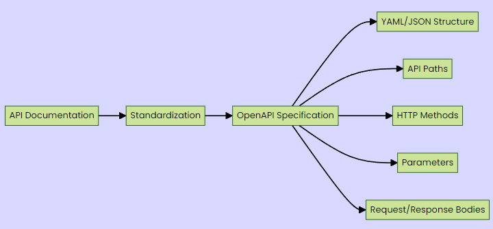
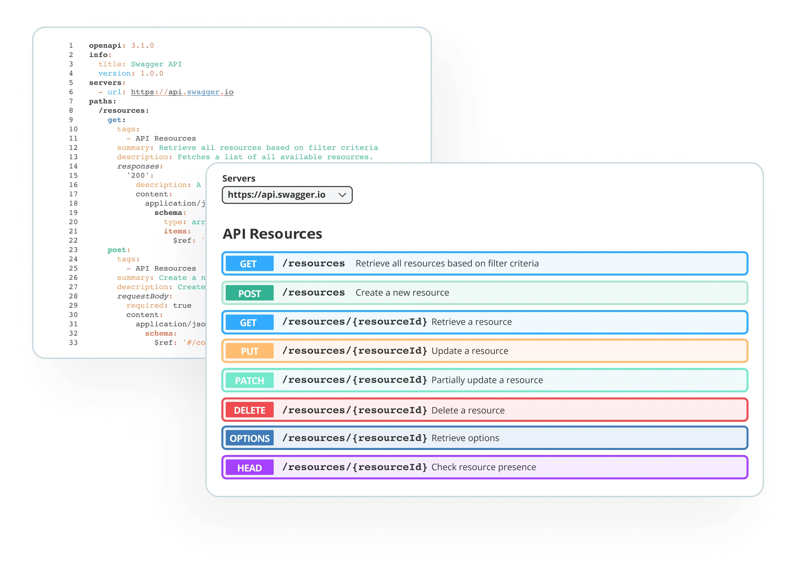
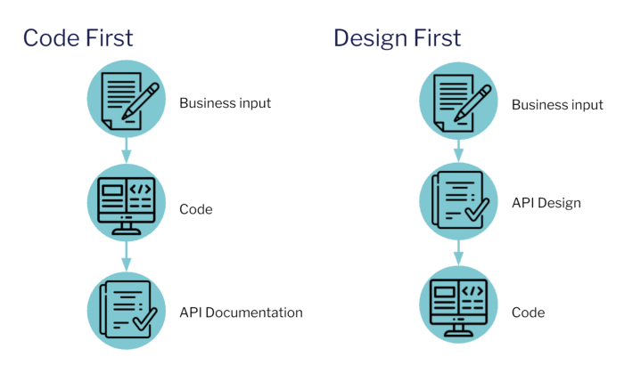
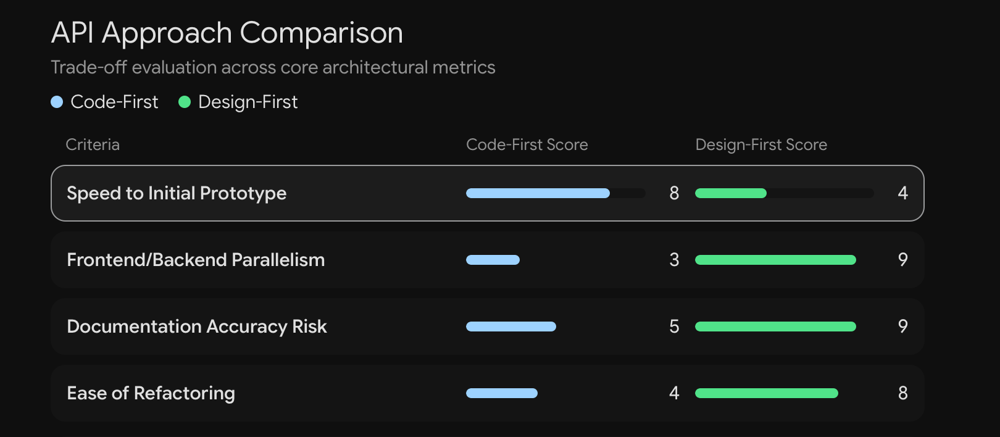

# Untitled

## The Baseline: The Task Project and API Endpoints

To understand the problem API documentation solves, the source starts by looking at a previously built "Task Project" (from a real-time video tutorial). This project has a route table with about six endpoints.

Specifically, there is a `move` endpoint located at `/api/move`.

- **The Inputs:** It expects a JSON body with three fields: `taskId`, `to`, and `actor`.
- **The Outputs (Status Codes):** Depending on what happens in the service or repository layer, the backend responds with different HTTP status codes:
    - **200:** The operation was successful.
    - **400 or 404:** A validation error or client error (e.g., passing a 404 means the requested task does not exist).
    - **500 or 502:** A server-side bug or error.

The **React front end** built for this project inherently "knows" this information. It knows to call `/api/move`, pass those exact three fields, and handle a 404 as a "task does not exist" state.

## The Problem: Syncing API Knowledge (Three Truths)

The core problem is asking: *Where does this knowledge actually live?* Currently, it lives in three separate places simultaneously:

1. **The Backend Handler:** This is the actual code that reads the JSON body. It is the absolute source of truth because it executes the logic.
2. **The Frontend (JavaScript/React):** The specific `fetch` or `axios` call in the frontend contains a duplicate of this knowledge, as it must format the request correctly to be accepted by the backend.
3. **The Documentation:** If an engineer wrote a spec document outlining the API's requirements and expectations, that document is a third copy of the same knowledge.

Having three copies of the same knowledge creates a dangerous syncing problem.

- **The Scenario:** A colleague decides that the field name `to` is unintuitive and renames it to `column` in the backend.
- **The Breakage:** They update the backend handler. They *might* remember to update the React frontend so the app doesn't break. However, because the written documentation doesn't enforce any actual code behavior, they forget to update it.
- **The Consequence:** Months later, a new engineer wants to integrate this API into a new page. They read the stale documentation, send the field as `to`, and receive a 400 validation error from the backend. The document (which claims to be the source of truth) lied to them.

## The Root Cause: Local vs. Network Boundaries

This syncing problem only exists because the communication crosses a **remote network boundary** (HTTP).

**The Local Compile-Time Comparison:** Imagine you are strictly working inside the boundary of your Go backend. You have a function that accepts specific arguments and returns specific values. This is the **function signature**. If you change a parameter name from `to` to `column`, or change its type from a string to an integer, the Go compiler will immediately throw an error across your entire codebase wherever that function is called. You catch the error during *development time*(compile-time).

**The Remote Run-Time Vulnerability:** When you cross a network boundary using HTTP, you lose the compiler. There is no standard "signature" for an HTTP request that the network enforces. If the frontend sends wrong data, you only find out during *runtime* when the request actually hits the server and fails.

*Why this matters (not stated in the source):* Finding bugs at compile-time takes seconds and costs nothing. Finding bugs at runtime means the code might have already shipped to users, causing application crashes and a poor user experience.

## The Solution: OpenAPI Specification (Freezing the Signature)

To give a remote network call the same strict, compile-time protection as a local function call, we need to "freeze" the signature of the API. We need a centralized document that lists:

- Available routes.
- Expected query parameters, path parameters, and request body fields (down to their exact data types).
- All possible response structures.

This cannot be a plain markdown or text file; it must be a programmatic, machine-readable format that enforces the contract. This specification is called the **OpenAPI Specification**.

OpenAPI Specification Structure. Source: Medium

**History & Wordnik:** In 2010, a startup named Wordnik had about six engineers and an API. Their customers wanted client SDKs (libraries) written in various languages (Python, PHP, JavaScript, Go, Rust) along with documentation for each. Writing these manually was impossible. Tony Tam, the creator of the specification, realized: *"We often code faster than we can document."*

The solution was to make the server describe itself in a JSON file. Because the JSON file is just a description of the backend (and does not enforce any specific programming language), other programs could read that JSON and automatically generate the client SDKs in whatever language the customer wanted.

**Advantages of the OpenAPI File:**

1. **Rendering Documentation:** It creates highly interactive, beautiful UIs (using tools like Swagger or Scalar) where users can read specs, insert a token, send a sample request body, and see the live response.
2. **Generating Client Libraries:** Programs can read the file and generate fully typed, off-the-shelf function calls for the frontend. No manual `fetch` writing required.
3. **Server Validation & Boilerplate:** It can generate backend interfaces and automatically validate incoming query/path parameters and request bodies before they even hit your handler logic.

## Clarifying Terminology: OpenAPI vs. Swagger & History

The terminology in this space is notoriously confusing. Here is the strict breakdown:

- **OpenAPI Specification (OAS):** The abstract set of rules governing what fields should exist and what they mean.
- **OpenAPI Description (OAD):** The actual physical file you create (e.g., `openapi.json` or `openapi.yaml`) that obeys the OAS rules.
- **OpenAPI Initiative (OAI):** The organization that publishes and maintains the rules. It is part of the **Linux Foundation**.
- **Swagger:** This was the original name for the OpenAPI Specification. Today, "Swagger" does *not* mean the specification itself; it refers specifically to **Swagger UI**, the tooling that renders the file into a readable web page.

Swagger UI interactive documentation. Source: Swagger

**JSON vs YAML:** Your Open API Description can be written in JSON or YAML. They are completely interchangeable and support the same features. However, YAML is a superset of JSON and allows for comments, making it the preferred format for humans writing specs by hand.

**The Timeline:**

- **2010:** Wordnik creates the JSON description.
- **2011:** Swagger 1.0 is open-sourced.
- **2014:** Swagger 2.0 is released, and industry adoption explodes.
- **2015:** SmartBear (a tools company) buys Swagger and donates the specification to the Linux Foundation (with founding members like Google, Microsoft, IBM, and PayPal).
- **2016:** The specification is officially renamed from Swagger 2.0 to OpenAPI 2.0 (the exact same content, just a new name).

*Note on Versions:* As of this source material, the current version of the spec is **3.2.0**. However, the industry predominantly writes in the **3.1.0** version because the vast majority of existing generation tools and parsers only support up to 3.1.0.

## The Anatomy of an OpenAPI Document - Root Level & Paths

The smallest valid OpenAPI file requires specific root-level fields:

1. `openapi`: Specifies the exact version of the specification being used (e.g., `"3.1.0"`). This is critical so tools know how to parse it.
2. `info`: Contains the `title` and `version` of *your specific backend API* (e.g., your internal route versioning), not the OpenAPI spec version.
3. You must include at least one of these three fields: `paths`, `components`, or `webhooks`.
4. `servers`: A list of base URLs where the API lives (e.g., local server `localhost:8080`, staging, or production). Defining this at the root means you don't have to re-type the full URL for every single endpoint.
5. `security` and `tags`: Global configurations for authentication and grouping endpoints.

**Paths and Operations:** The `paths` object is a map. Every key is an endpoint and **must start with a slash** (e.g., `/api/board`). Underneath the path is the **Path Item**, which contains an entry for every valid HTTP method at that address (e.g., `get`, `post`, `put`, `patch`, `delete`, `head`, `options`).

Each HTTP method is called an **Operation**. An operation contains:

- `summary`: A one-line title.
- `description`: A longer explanation (supports Markdown formatting).
- `tags`: Used by documentation UI to group related endpoints (e.g., all Task endpoints together).
- `operationId`: A strictly unique name for this operation across the whole file.
    - *Best Practice:* Format this as a function name (e.g., `getBoard`).
    - *Why this matters:* When you use tools to generate client SDKs, the tool will read the `operationId` and literally create a JavaScript or Go function with that exact name.

**Path Parameters:** If a URL has a dynamic portion—like fetching a specific task by its ID—the standard HTTP semantic is to place it in the URL path, not a query string. In OpenAPI, dynamic portions are represented using curly braces: `/api/tasks/{id}`.

## The Anatomy - Inputs (Parameters & Request Body)

An operation can take inputs via `parameters` or a `requestBody`.

**Parameters:** Parameters can live in four different locations, denoted by the `in` field:

1. **query:** Appended to the URL (e.g., `?since=123`). The source uses a polling endpoint as an example where `since` is an integer representing the last sequence number the client received.
2. **path:** The dynamic `{id}` mentioned above.
    - *Crucial rule:* Path parameters **must** have the `required` flag set to true. If a path parameter was optional, the URL structure itself would break and become two entirely different routes.
3. **header:** e.g., passing a `Last-Event-ID` header to reconnect to a stream.
4. **cookie:** Data passed via browser cookies. All parameters contain a `name`, the `in` location, a `required` boolean flag, and a `schema` defining their data type.

**Request Body:** For `post`, `put`, or `patch` requests, data is sent in the body. The `requestBody` field requires a `content` map, which pairs a **media type** to a schema. Common media types include:

- `application/json`: Standard JSON data.
- `multipart/form-data`: Used for file uploads.
- `application/x-www-form-urlencoded`: Used for traditional HTML form submissions.

*Example from the Task App:* The `/api/move` endpoint accepts `application/json`. Its schema defines three fields: `taskId`(required), `to` (required), and `actor` (optional, but if omitted, the backend defaults the value to `"guest"`).

## The Anatomy - Outputs (Responses) & The Schema Object

**Responses:** Every operation must define what it returns under `responses`. Responses are mapped to HTTP status codes.

- *Formatting Rule:* The status code must be written in quotes as a string (e.g., `"200"`), because JSON keys must be strings.

*Example from the Task App (`/api/move`):*

- `"200"`: Successful. Returns the event data schema.
- `"400"`: Client error. Returns an error schema.
- `"404"`: Not found (no task with that ID). Returns an error schema.
- `"502"`: Bad Gateway. The move was successful in the database, but the server failed to publish it to the message bus.

**The Schema Object:** The schema object is the workhorse of the OpenAPI spec. It defines the exact shape and data types of every field in your inputs and outputs.

- `type`: Can be `string`, `number`, `integer`, `boolean`, `array`, `object`, or `null`.
- *Validations:* You can stack properties to strictly enforce shapes.
    - Strings can have a `minLength`, `maxLength`, a Regex `pattern`, or an `enum` (e.g., forcing a status string to strictly equal `"active"`, `"inactive"`, or `"deleted"`).
    - Numbers can have a `min` and `max`.
    - Arrays must have an `items` field detailing the schema of the elements inside the array.
    - Objects contain `properties` (keys must be strings, values are nested schemas).

## Implementation Strategy: Code-First vs. Design-First

Because the OpenAPI specification acts as the contract between the server and the client, a fundamental architectural question arises: Do you write the code first, or the contract first?

Source: Gravitee

**Code-First:** You write your backend handlers and service functions first. The OpenAPI file is generated as a byproduct of your code.

- *Historical Context:* The team that invented Swagger originally used this approach because they already had an existing codebase and needed to generate docs for it.
- *Implementation:* You can do this via code comments above handlers (which are parsed by a tool), or through structural libraries. For example, using **Zod** schemas in Node.js combined with the **ts-rest** library to attach schemas to paths, which are then passed to a generator function to spit out an `openapi.json` file. In Python, the **Fast API**framework natively parses your handler annotations to automatically generate and serve the OpenAPI file.

**Design-First (Contract-First):** You write the OpenAPI specification file *before* you write a single line of backend logic.

- *Why this is preferred (The Agentic Era):* It establishes the contract immediately. Once the contract is written, frontend and backend teams can work completely in parallel. The frontend doesn't have to wait for the backend to finish building the database logic; they just build against the agreed-upon contract. This is especially useful when using AI agents, as you can spin up parallel agents to work on client and server sides simultaneously without them blocking one another.

## The Design-First Pipeline (6 Stages)

To implement a Design-First workflow (using the Tasker app as an example), the source outlines a robust 6-stage pipeline built around the OpenAPI file as the single source of truth:

1. **Stage 1: The Linter (`spectral`)** Just as we have ESLint for JavaScript or Go linters, we need a linter for the OpenAPI YAML/JSON. **Spectral** is a tool that reads the specification file and throws errors for bad formatting or missing best practices (e.g., missing descriptions on operations, missing contact info on the info object, or missing schemas on responses).
2. **Stage 2: The Mock Server (`prism`)** Before the real backend exists, a tool called **Prism** reads the OpenAPI file and instantly spins up a fake server. If the frontend sends a request to Prism, Prism validates the request against the OpenAPI schema, and responds using the exact mock examples you provided in the spec file. The frontend team builds against this.
3. **Stage 3: The Client Generator (`openapi-typescript` & `openapi-fetch`)** You feed the spec file into **openapi-typescript**, which generates native TypeScript types for every path, field, and response. You then use **openapi-fetch** to make the actual API calls. Because everything is typed from the source of truth, if a frontend dev misspells a parameter or passes a string instead of an integer, the TypeScript compiler will throw a compile-time error. We have successfully brought local compile-time safety to a remote network call.
4. **Stage 4: The Server Generator (`oapi-codegen`)** You feed the same spec file into a tool like **oapi-codegen**. It reads the file and generates strict Go interfaces. The backend developer must then write handler code that perfectly satisfies those generated interfaces. If you update the OpenAPI file with a new field, the Go compiler will instantly fail at the handler level until the backend dev implements the new field.
5. **Stage 5: Documentation Rendering** The same file is fed into UI tools. You can use **Swagger UI** (the traditional choice), **Redoc**, or **Scalar**. The source notes that Scalar provides a much more modern, clean UI for interactive API testing.
6. **Stage 6: Testing the Real Server (`schemathesis`)** How do you guarantee the backend code actually honors the contract? A tool called **Schemathesis** reads the OpenAPI file, generates hundreds of fake requests (both valid ones and intentionally invalid ones designed to break things), sends them to the *real* running server, and verifies that the server's responses perfectly match the OpenAPI contract. If the server responds with a 200 when the spec says it should throw a 400 for bad data, Schemathesis flags it.

## Industry Standards and AI Agents

OpenAPI is the undisputed standard for the tech industry. Massive platforms publish their OpenAPI files publicly so developers can easily integrate with them. For example:

- **GitHub's** OpenAPI specification is roughly 344,000 lines long.
- **Stripe's** OpenAPI specification is roughly 171,000 lines long.

Finally, in the modern era of AI, when you give an AI agent a "tool" to call (allowing it to browse the web, edit a file, or fetch data), the description of that tool is almost always passed to the agent using the OpenAPI specification format.
