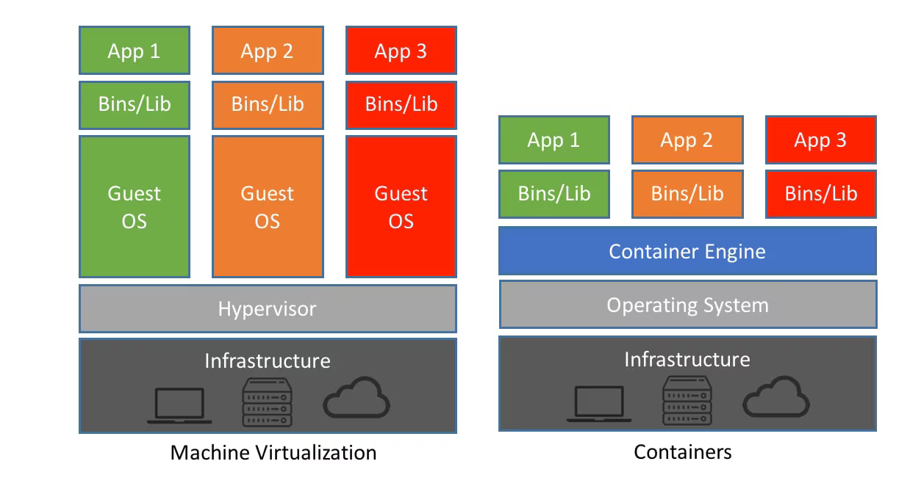
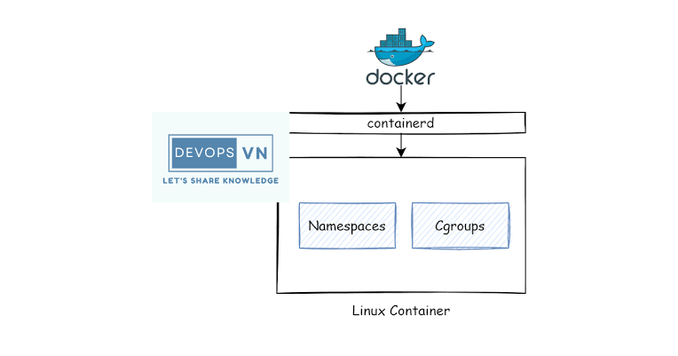
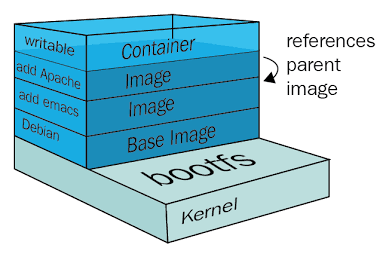
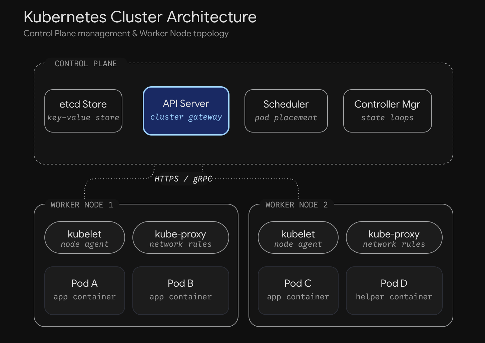
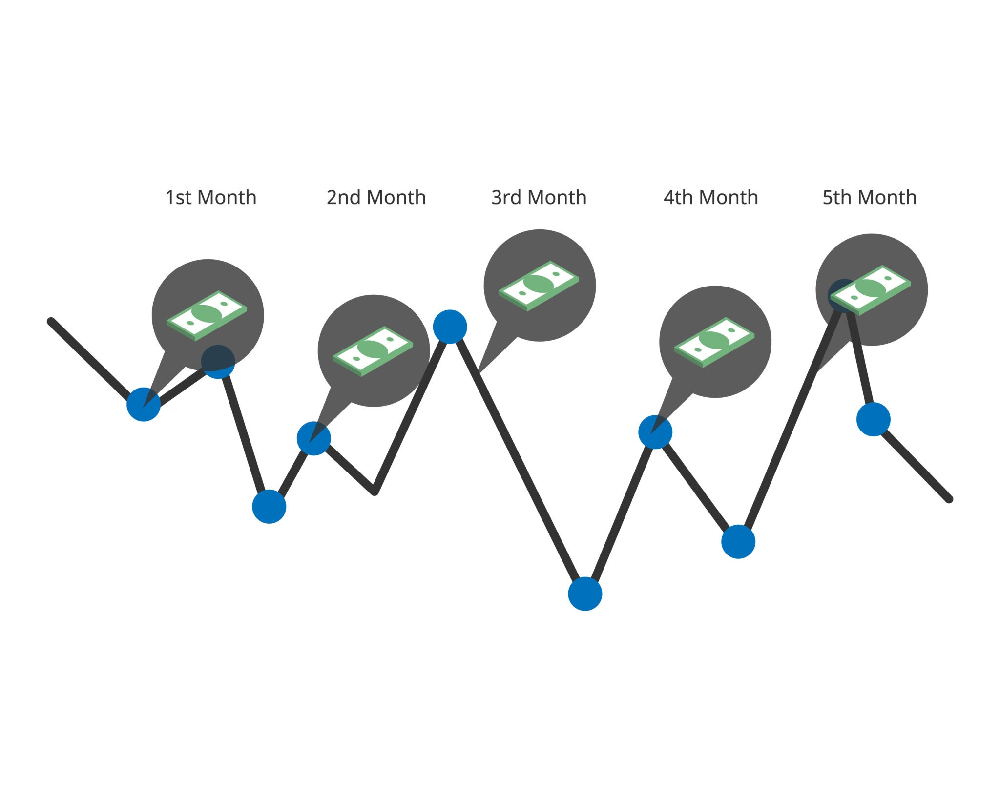

# Untitled

## The Goal of DevOps: From Localhost to the Internet

When you build an application, everything runs on your own machine. Your handlers, the database, the API requests—it all serves over **localhost**. But localhost is inaccessible to your users.

**DevOps** is the practice that solves this. It encompasses the entire journey from the moment you commit a code change to the moment that code is running live over the internet—capable of serving millions of users, surviving failures, and allowing for new features to be pushed continuously without a single second of downtime. Traditionally, "DevOps" is just a merger of two words: **Development** and **Operations**.

## The Two Teams and the Conflict of Interest

In mid-sized or large companies, this workload was historically split into two entirely separate teams:

1. **The Development Team:** Frontend engineers, backend engineers, and testers who write the actual code. They are measured by *speed*—how fast they can build features and push them to production.
2. **The Infrastructure (Ops) Team:** The engineers who set up the servers, deploy the code, and monitor the servers for downtime and alerts. They are measured by *stability*—how rarely the production servers go down.

**The Conflict:** Because the Ops team wants production to be as stable and error-free as possible, they want *as few deployments as possible*. Why? Because every time new code is deployed, it adds entropy and risks breaking the infrastructure. Conversely, Developers want *as many deployments as possible* to get their features out.

When a bug occurs, developers blame the infrastructure ("It works on my machine"), and Ops blames the code. This friction historically delayed release cycles to once a week or once every two weeks. The "DevOps Movement" was born as a collection of ideas to streamline this process, moving away from manual server configuration and toward automation, version control, and shared observability.

## Measuring Success: The DORA Metrics

To actually measure DevOps practices, a research team called **DORA** (DevOps Research and Assessment) surveyed tens of thousands of teams and identified four key numbers:

**Measures of Speed:**

1. **Change Lead Time:** The time it takes for a commit to go from a developer's laptop to running live in production. If a commit is merged at 9:00 AM and users see it at 11:00 AM, the lead time is 2 hours.
2. **Deployment Frequency:** Exactly what it sounds like—how often code is deployed to production.

**Measures of Stability:** 3.  **Change Failure Rate:** The percentage of deployments that cause a failure in production. If you do 100 deployments in a month and 4 cause an issue, the failure rate is 4%. 4.  **Failed Deployment Recovery:** How long it takes to recover when a failure happens.

Top-performing teams deploy on-demand (lead time under a day), fail on about 5% of deploys, and recover in under 60 minutes. The worst-performing teams deploy once every 1 to 6 months, fail 40% of the time, and take a week to recover.

## The Myth of the Speed vs. Stability Trade-off

You might assume that pushing code constantly makes a system *less* stable. But the DORA metrics reveal the exact opposite: **The groups doing more deployments are actually more stable.** Speed and stability are not a trade-off.

*Why this matters (not stated in the source):* When you deploy 200 commits from 20 developers once a month, identifying exactly *which* commit broke production can take an entire day. When you deploy *every single commit* as it happens, the deployment contains one change from one person made an hour ago. Pinpointing the bug is trivial, the context is fresh in the developer's mind, and the fix can be written and shipped immediately. **The thumb rule: Make deployments as frequent and as small as possible.**

## Continuous Integration (CI) and Branching Models

To reach that goal, we start at the ground level:

**Continuous Integration (CI)** is the practice where every developer merges their work into one shared branch *at least once a day*. Every merge is then tested by an automated build server.

While people often refer to tools like GitHub Actions or Jenkins as "CI," CI is technically just the practice; the server simply enforces it.

*Why merge every day?* If two developers work on separate branches for 3 weeks, their code will have drifted so far apart that resolving merge conflicts will take hours and risk breaking logic. If they merge daily, the drift is minimal, and conflicts are easily solved.

**Branching Models:**

- **GitFlow (The old way):** Has `develop`, `release`, `hotfix`, and `master/main` branches. This was built for desktop/mobile apps where users install specific versions and you have to support Version 2 while building Version 3.
- **Trunk-based Development (The modern way):** The author of GitFlow explicitly stated that web applications should use something simpler. Trunk-based development uses one `main` branch. Developers make temporary feature branches that live for 1-2 days, merge them into `main`, and delete them. The `main` branch is what deploys to production.
- **Feature Flags:** If a feature takes 3 weeks to build, you still merge the incomplete code into `main` daily, but you hide it behind a **feature flag** (a toggle stored in a database or edge cache). The code lives in production, but users can't access the feature until the flag is flipped.

## The Build Process and Reproducible Artifacts

A **build** takes source code and transforms it into an executable **artifact** or binary. It compiles the code and downloads dependencies.

An ideal build must be **reproducible**. The same source code run through the same build should output a byte-identical binary every time, regardless of what machine runs it. To achieve this, the build must not rely on the host machine's environment. It must declare exact compiler and dependency versions.

**Lock Files in Action:**

- **Go:** Running `go build` with a pinned Go version and a `go.sum` file checked into Git ensures exact package dependencies.
- **Node.js:** Running `npm ci` (clean install) alongside a `package-lock.json` file ensures exact module versions.

**Stamping:** When creating this final binary, we usually stamp it with the **commit hash** of the `main` branch so we can query the running server to verify exactly which commit is live.

## Deployment Pipelines and GitHub Actions

When you combine the build and test phases, you get a **Deployment Pipeline**. This is a sequence of stages your code passes through. The golden rule is to put the fast/cheap stages first, and the slow/expensive stages last:

1. **Fast Stage:** Compile code and run unit tests (takes minutes). If it fails, stop the pipeline and alert the developer immediately.
2. **Slower Stage:** Run integration tests against actual databases or deploy to a staging environment.
3. **Final Stage:** Push to production.

**GitHub Actions** is a popular pipeline tool. It uses five core concepts:

1. **Workflow:** A YAML configuration file (stored in `.github/workflows`) dictating when and what to run.
2. **Event:** What triggers the workflow (a `push`, a pull request, a schedule, or manual click).
3. **Job:** A set of steps running on one machine. Jobs can run in parallel or wait for each other.
4. **Runner:** The actual fresh virtual machine GitHub spins up to run the job (and kills afterward). You can also host runners yourself.
5. **Step:** A single command or action inside a job.

### 1 Checkout Code

Start of the Test Job

Because runners are entirely fresh VMs, the very first step must always be pulling down the source code.

### 2 Setup Environment

Installs the language runtime (e.g., setting up the Go compiler).

### 3 Run Tests

Executes unit tests.

### 4 Build Binary

Start of the Build Job

This job waits for the Test job to finish. It builds the binary and uploads it as an artifact.

### 5 Package Image

Waits for the Build job, then packages the binary into a container image.

## Securing Cloud Access: OIDC vs. Repository Secrets

Eventually, the pipeline needs to deploy to your cloud infrastructure (like AWS). To do this, it needs credentials.

Historically, teams used **Repository Secrets**—storing permanent API keys inside GitHub. The problem: *any* job running in that repo could access the key. If leaked, an attacker had permanent access until a human manually revoked the key.

The modern, secure solution is **OIDC (OpenID Connect)**.

1. When a job starts, GitHub's identity provider issues a short-lived token (a signed JSON document) stating: *"This token belongs to Job X, in Repo Y, on the Main branch."*
2. You configure AWS beforehand to trust tokens signed by GitHub *only* if they claim to be from that specific repo and branch.
3. The GitHub runner gives AWS the token. AWS verifies the signature and hands back temporary credentials.
4. The moment the job ends, those credentials expire. There are no permanent secrets to steal.

## Versioning for Internal Deployments

When building open-source libraries for others, we use **Semantic Versioning** (`major.minor.patch`). A patch fixes a bug, a minor adds non-breaking features, and a major introduces breaking changes.

But for deploying our *own* backend services, users don't care about the backend version number. Therefore, we don't use semantic versioning. We tag deployments, artifacts, and running instances using the **commit hash** (and sometimes a build ID). We expose this hash via a `/info` or `/health` endpoint so we can check if a deployment succeeded.

## The "It Works on My Machine" Problem: Virtual Machines vs. Containers

You build a Go binary locally, move it to a production server, and it fails. Why? Maybe the server has an old system library, a different time zone database, or you built against Node.js 22 but the server has Node.js 18.

To solve this, **we don't just ship our code; we ship our environment**. We package the runtime, libraries, files, and exact versions into a unit called a **Container**.

Developers often confuse containers with Virtual Machines (VMs).

| Feature | Virtual Machine | Container |
| --- | --- | --- |
| **Architecture** | A hypervisor partitions hardware. Every VM runs its own full **Operating System Kernel** (the OS core) and virtual disks. | An ordinary process running on the host machine. It does **not** have its own kernel. |
| **Isolation** | Very strong isolation (they are completely separate systems). | Isolation is an "illusion" provided by the host OS kernel treating the process specially. |
| **Weight** | Very heavy (requires GBs of RAM, slow boot times). | Lightweight (requires MBs of RAM, near-instant boot times). |

VM vs. Container Architecture. Source: NetApp

## How Containers Work: Linux Kernel Features

Because a container is just a normal Linux process (if you run `ps` on the host, you will see the container's processes), the isolation is achieved using three specific Linux kernel features:

### 1. Namespaces (What a process can SEE)

Namespaces wrap global system resources so a process thinks it's alone. Instead of seeing the whole machine, it sees its own private copy. Currently, Linux has around 8 namespaces, including PID, Mount, Network, UTS (hostname), IPC, User, Cgroup, and Time.

- **PID Namespace:** The process sees itself as Process ID 1. It cannot see any host processes.
- **UTS Namespace:** Gives the container its own hostname.
- **Network Namespace:** Gives the container its own network interfaces, IP routing tables, and ports. This is why two containers can both run on port 80 without crashing—they each have their own private port 80.

To manipulate namespaces, the OS provides three system calls:

- `clone`: Creates a new process (with flags to put it in new namespaces).
- `unshare`: Moves an existing process into a new namespace.
- `setns`: Joins an existing namespace.

**Containers from Scratch (Liz Rice):** You can build a container in ~76 lines of Go. The critical part is calling `clone` with flags like `new UTS`, `new PID`, and `new mount namespace`. The child process changes its hostname to "container", uses a Mount namespace to change its root directory to an Ubuntu folder, mounts a fresh `proc` filesystem (so `ps` works), and runs a shell.

### 2. Control Groups / cgroups (What a process can USE)

Namespaces limit what a process sees, but a container could still consume 100% of the host's RAM. To prevent this, the kernel uses **cgroups**. A cgroup is literally just a folder located at `/sys/fs/cgroup`. Inside are plain text files like `memory.max`, `cpu.max`, and `cgroup.procs`. If a tool like Kubernetes assigns a 512MB memory limit to a container, the `kubelet` program writes that exact number into the `memory.max` file, and writes the process ID into `cgroup.procs`. If the process exceeds that RAM, the kernel's **OOM (Out Of Memory) Killer** steps in and kills the process, resulting in the famous "OOMKilled" status.

Linux Kernel container isolation. Source: Medium

## Container File Systems: OverlayFS and Image Layers

When that Go program did a `chroot` into an Ubuntu folder, did it copy all 100MB of Ubuntu files? No. Container file systems use **Layers** managed by a file system called **OverlayFS**.

A layer is a "tarball of changes" (like a zip file showing what files were added, modified, or deleted). OverlayFS takes a list of **lower directories** (which are read-only layers) and puts one **upper folder** (which is writable) on top, presenting them as a single combined view.

- If you read a file, OverlayFS looks down from the top and serves the first copy it finds.
- If you write or modify a file, OverlayFS copies the file up to the writable upper folder and makes the change there.

Because lower layers are strictly read-only, **10 containers can boot from the exact same image and share the exact same base layers on the hard drive**, saving massive amounts of space. When a container is stopped, its writable upper directory is thrown away. Container file systems are **disposable**. If you need data to persist, you must mount external storage.

### The Structure of an Image

A Docker/Container image isn't one file; it's three JSON documents and a set of **blobs**. (A blob is a collection of binary unstructured data, like a PDF or video, that only makes sense as a whole).

1. **Blobs:** The actual layers (tarballs). They are identified by the SHA-256 hash of their data.
2. **Config JSON:** Lists the layers in order and settings (environment variables, commands, ports).
3. **Manifest JSON:** Points to the config and lists the hash and size of every layer.

The "ID" of a Docker image (e.g., `ubuntu:24.04`) is the hash of the Manifest JSON. Because layers are identified by hash, a registry knows exactly which layers it already has.

Docker Layers and OverlayFS. Source: Packt Subscription

### Dockerfiles and Layer Caching

A `Dockerfile` is the recipe to build these layers. Every instruction that alters the file system (`FROM`, `COPY`, `RUN`) creates a new layer. Docker caches layers top-down. The moment an instruction's input changes, that layer **and every layer below it** must be rebuilt.

- **Bad pattern:** `COPY . .` (copy all code), then `RUN npm install`. Every time you change one line of code, the cache invalidates, and Node has to download all dependencies again.
- **Good pattern:** `COPY package.json .`, then `RUN npm install`, then `COPY . .`. Because dependencies change rarely, the heavy `npm install` layer is cached, and only the final source code layer rebuilds when you code.

**Multi-stage builds:** For compiled languages like Go, a Dockerfile can have two stages. Stage 1 uses a heavy image with compilers to build the binary. Stage 2 starts from a tiny base image (like Alpine or scratch) and simply copies the built binary over. The compiler tools are left behind, drastically reducing image size.

## Container Registries and Runtimes

The **Registry** (Docker Hub, GitHub Container Registry, AWS ECR) is the HTTP server where images are stored. It acts as the intermediary because the build server and run server are usually different machines. When you push an image, it uploads the blobs (only the hashes the registry doesn't already have), then the config, then the manifest. When you pull, it grabs the manifest, checks which blob hashes your local machine is missing, and downloads only those.

When you type `docker run`, Docker isn't doing the heavy lifting.

1. The Docker CLI sends the command to `dockerd` (the Docker daemon).
2. `dockerd` hands it to `containerd` (a smaller process that manages image/container lifecycles).
3. `containerd` hands it to `runC` (a program that reads the JSON spec and executes the actual kernel system calls like `clone` and writes the `cgroup` files). `runC` exits, leaving the process running.

This stack is standardized by the **OCI (Open Container Initiative)**. Because of OCI, an image built with Docker can run on Kubernetes without Docker even being installed, communicating via the CRI (Container Runtime Interface) directly to `containerd`.

## Properties of a Good Container Image and Buildpacks

Before running an image in production, ensure it is:

1. **Small:** Fewer files mean faster downloads and fewer vulnerabilities.
2. **One Process:** It should only run your backend app. No background crons or init systems.
3. **Non-root:** It must run as an unprivileged user. If an attacker exploits your app, they don't gain root access to the host kernel.
4. **Pinned:** Use a specific base image version (`node:18.4.2`), never `latest`.
5. **Scanned:** Use vulnerability scanners to check the base image packages against known CVE databases.

*Note on Buildpacks:* Platforms like Render and Railway use **Buildpacks** or **Nixpacks**. They automatically detect your language via files like `package.json` or `go.mod` and dynamically generate optimized, secure container images without you ever writing a Dockerfile.

## Running Containers on a Single Machine

To run a service on a Linux machine, you need three things:

1. **A process manager:** Usually **systemd**, the init system built into Linux. You write a `.service` unit file that tells it what command to run (e.g., `docker run`), what user to run as, and to `Restart=on-failure`.
2. **Logs:** Standard output goes to the system journal, readable using `journalctl`.
3. **Reverse Proxy:** A tool like **Nginx** or **Caddy**. The firewall opens port 80/443, traffic hits the reverse proxy, which terminates the TLS connection and forwards traffic to the internal container port.

## Automating HTTPS with Let's Encrypt and the ACME Protocol

Serving HTTPS used to require manual human approval. Today, it is fully automated via the **ACME protocol** and **Let's Encrypt** (a free certificate authority).

1. Your server's ACME client generates a key and requests a certificate for your domain.
2. Let's Encrypt issues a **challenge**: "Put this random token at this URL on Port 80, or create this DNS record."
3. Your client completes the challenge. Let's Encrypt verifies the token from the public internet.
4. Once verified, it signs and returns the certificate.

The certificate is intentionally only valid for **90 days**. The client automatically renews it every 60 days. If the key is ever stolen, it becomes useless quickly. Modern reverse proxies like Caddy handle this entire ACME dance internally with zero configuration.

## Scaling Out and Tooling Like Kamal

If you need more capacity, you don't buy a stronger server; you add *more* servers (Horizontal Scaling). But managing 3 machines by hand is complex.

Tools like **Kamal** automate this over SSH. Kamal logs into the hosts, installs Docker, pulls the new image, starts the new containers alongside the old ones, and waits. It polls a `/health` endpoint on your backend. Only when that endpoint returns a 200 OK does it switch the Nginx/Caddy traffic to the new containers and kill the old ones, ensuring zero downtime.

## Immutable Infrastructure vs. Snowflake Servers

If a human sets up an EC2 machine by hand in the AWS console, it becomes a **Snowflake**. Over time, configurations drift, unrecorded tweaks are made, and if that engineer leaves, nobody knows how to rebuild the server if it crashes.

The 12-Factor App methodology demands **Immutable Infrastructure**. A server is never modified or patched over SSH after it starts. If you need a change, you change the code and deploy a brand new replacement. Containers make this cheap and easy, replacing the image rather than the whole OS.

## Kubernetes: The Container Orchestrator

When you have 40 containers across 10 machines, Kamal isn't enough. You need an **Orchestrator**. The industry standard is **Kubernetes** (open-sourced by Google).

Kubernetes operates on **declarative state**. You don't give it step-by-step instructions. You hand it a document saying, "I want 3 copies of this image running," and Kubernetes figures out how to make reality match that document.

### Kubernetes Architecture:

**The Control Plane:**

- **API Server:** The front door. It receives your document and stores it.
- **etcd:** A distributed key-value store. This is the cluster's memory/database.
- **Controllers:** Programs running in continuous loops. They compare "what you asked for" with "what currently exists." If you asked for 3 pods and 1 machine dies leaving 2 pods, the controller starts a new one to reach 3.
- **Scheduler:** The specific controller that decides *which* physical machine a new container should run on based on resources.
- **Controller Manager:** Runs the built-in controller loops.

**The Nodes (Worker Machines):**

- **kubelet:** The primary agent on every machine. It asks the API server, "What should I run?" and uses `containerd` to start it.
- **kube-proxy:** Takes care of networking rules for services.

### Kubernetes Objects:

- **Pod:** The smallest unit in K8s. It is *not* a container; it is a wrapper that holds one or more containers that share a network namespace and volumes. (Usually just your app container, plus maybe a helper/proxy container). Pods are ephemeral and mortal—when they die, they are gone forever.
- **ReplicaSet:** A controller that ensures N number of pod copies are running.
- **Deployment:** A higher-level abstraction that owns ReplicaSets. When you deploy a new image, the Deployment creates a *new* ReplicaSet and slowly shifts the pod count from the old ReplicaSet to the new one. (We only write Deployments, never ReplicaSets manually).
- **Service:** Because pods die and their IP addresses constantly change, a Service provides a static, fixed virtual IP and DNS name. It acts as a load balancer, routing traffic to whichever pods currently match its labels (e.g., `app=backend`).
- **Ingress / Gateway API:** Maps public internet hostnames and paths (like `api.example.com/v1`) to internal Kubernetes Services. It programs an actual cloud load balancer.

## Kubernetes Configuration and Scaling

- **ConfigMap:** Stores non-sensitive configuration as key-value pairs (mounted as env vars or files in the pod).
- **Secret:** Stores sensitive API keys and credentials.
- **Requests & Limits:** Resources declared per container.
    - *Request:* Amount of RAM/CPU reserved on the machine.
    - *Limit:* Hard cap written to Linux `cgroups` (`memory.max`). Exceeding this causes OOMKilled.
- **Horizontal Pod Autoscaler (HPA):** Automates scaling. It watches average CPU usage across pods; if it spikes above a target, it automatically increases the replica count.

## Zero Downtime Deployments: Rolling Updates and Probes

By default, Kubernetes uses a **Rolling Update** deployment strategy, governed by two numbers:

- `maxSurge`: How many pods *above* the desired count can exist during deployment (default 25%).
- `maxUnavailable`: How many pods *below* the desired count can exist (default 25%).

K8s starts 1 new pod. Once the pod is "ready", it kills 1 old pod. It repeats this loop until all old pods are gone. But how does it know a pod is ready? **Probes**. Probes are checks run by the `kubelet` (like pinging a `/health` endpoint).

1. **Readiness Probe:** If this fails, the pod is temporarily removed from the Service load balancer (stops receiving traffic) but is *not* killed. It simply indicates the pod is too busy to serve right now.
2. **Liveness Probe:** If this fails multiple times, the `kubelet` ruthlessly kills and restarts the container.
    - *Warning:* Never put database checks in a liveness probe. If the DB is slow, all pods fail liveness, Kubernetes restarts all pods simultaneously in a wave, hitting the DB with reconnection requests and bringing the entire system down. Liveness should only check if the process is completely frozen.
3. **Startup Probe:** Disables liveness/readiness until a slow-starting legacy app has finished booting.

## Continuous Delivery vs. Continuous Deployment

In a CI/CD pipeline, the final stages differ conceptually:

- **Continuous Delivery:** A technical property. Your software is *always* in a deployable state. All tests pass, and anyone can push a button to ship it to production safely.
- **Continuous Deployment:** A product/business decision. The "push button" is removed. Every commit that passes the pipeline automatically deploys to production multiple times a day without human intervention. (You cannot have Deployment without Delivery).

## Advanced Deployment Strategies

1. **Recreate:** Stop all old instances, start new ones. Causes outright downtime.
2. **Rolling Update:** One at a time. The flaw? Both old and new code serve traffic simultaneously for a few minutes.
3. **Blue-Green Deployment:** Run two complete production environments. "Blue" is live. Deploy the new code to "Green". Test Green privately. When ready, switch the load balancer router instantly. Pros: Zero downtime, instant rollback, only one version runs at a time. Cons: You pay for double the infrastructure.
4. **Canary Deployment:** Deploy the new code to exactly 1 pod. Route 10% of traffic to it. Monitor metrics (errors, latency). If healthy, widen scope to 20%, 50%, then 100%.
5. **Progressive Delivery:** Fully automating the Canary strategy using a software controller.

Progressive scaling analogy. Source: Piscine / Getty Images

## GitOps and Environments

**GitOps** is an infrastructure philosophy where the desired state of the *entire* system (Deployments, Services, ConfigMaps) is written declaratively in files and stored in Git. Instead of an external CI pipeline pushing code to the cluster (which requires giving the pipeline dangerous cluster admin credentials), an agent *inside* the cluster (like **ArgoCD** or **Flux**) constantly pulls from Git. If it notices a difference between the cluster and Git, it updates the cluster. Every deploy is just a Pull Request.

**Environments:**

- **Preview Environments:** Temporary live environments spun up for a specific Pull Request so reviewers can interact with the code. Destroyed when merged.
- **Promotion:** Moving the exact same compiled artifact from Development -> Staging -> Production, usually gated by human approval.

## Managing Machines: Infrastructure as Code (IaC)

If you had one hour to recreate your entire AWS account perfectly from scratch, could you? Not if you configured it by clicking through the UI manually.

**Infrastructure as Code (IaC)** solves this by writing the servers, networks, and permissions as code.

1. **Provisioning:** Creating the raw cloud resources (VPCs, EC2, Load Balancers). Tool: **Terraform** (or its open-source fork **OpenTofu**).
2. **Configuration Management:** Installing software on a raw machine. Tool: **Ansible**.
3. **Image Baking:** Creating a pre-configured machine image (AMI) so it boots ready to go. Tool: **Packer** (paired with `cloud-init`).

**Terraform State and Drift:** When Terraform creates an AWS resource, it saves the AWS resource ID mapping in a **state file**. Next time it runs, it queries AWS for the current state and compares it against the local file. The difference is the "plan".

- *Warning:* The state file contains plaintext secrets. Never commit it to Git. Store it remotely (like in an S3 bucket) with remote locking so two people don't run Terraform simultaneously and corrupt the infrastructure.
- **Drift:** If you manually open Port 22 in the AWS console during an emergency, your cloud has "drifted" from your Terraform code. The next time Terraform runs, it will see Port 22 isn't in your code, assume you want it gone, and forcefully close the port. **The code is the sole source of truth.**

## Tracking Reliability: Operations and Incident Management

To know if things are working, we quantify them:

- **SLI (Service Level Indicator):** A metric the user actually cares about (e.g., "Percentage of HTTP requests returning 200 OK within 300ms").
- **SLO (Service Level Objective):** A target for the SLI over a time window (e.g., "99.9% of requests succeed over 30 days").
- **SLA (Service Level Agreement):** A legal contract based on the SLO. If you drop below 99.9%, you owe the customer money.

*Understanding 9s:*

- 99.9% availability = 43 minutes of allowed downtime per month.
- 99.99% availability = 4.5 minutes of allowed downtime per month.

This allowed downtime is your **Error Budget**. You spend it intentionally on risky deploys or maintenance. If you burn through the 43 minutes by the 23rd of the month, the team must enact a code freeze. No more features ship; all engineering effort pivots to reliability until the month resets.

## On-Call Rotation and Outage Handling

Because servers break at 3 AM, teams use an **On-Call Rotation**. Every week, one engineer (and a backup) is assigned to receive urgent mobile notifications (**Paging**) when alerts trigger.

When an alert escalates into a full-blown **Outage** (users see blank pages), teams follow an Incident Response structure:

1. **Incident Commander:** Oversees the big picture. Does not touch the keyboard or fix the code.
2. **Responder/Engineer:** Focuses entirely on fixing the code.
3. **Communicator:** Updates the public status page and internal management so the engineers aren't interrupted.

*The Golden Rule of Outages:* The immediate goal is **not** to find the root cause. The immediate goal is to stop the bleeding (roll back the deploy, flip the feature flag). Once stable, you find the root cause.

Afterward, the team writes a **Postmortem**: a minute-by-minute timeline of the outage, the impact, the root cause, and the steps to prevent it. Crucially, this must feature a **Blameless Culture**. You never write "Bob typed the wrong command." You blame systems, not humans. If you blame the human, you will never learn *why* the system allowed the human to make the mistake in the first place.

## Surviving Failure: Chaos Engineering and Supply Chain Security

**Operating Principles:** Design for failure. Assume every dependency will crash. Keep deployments simple. Make one change at a time.

To ensure these principles work, companies practice **Chaos Engineering**. They intentionally cause failure in production during business hours (killing pods, deleting instances, adding latency) to prove their automated recovery systems actually work.

Finally, we must secure the **Software Supply Chain**. The code inside your Docker container isn't just your code. It's the base OS, the Go modules, the NPM packages.

- *Poisoned Dependencies:* In 2024, a compression library used in Linux shipped a backdoor. The backdoor was hidden in the release tarball, not the GitHub source code, bypassing reviewers.
- *The Fix:* Always pin exact dependency versions (never use `latest`) and continuously scan your Docker images against vulnerability databases.